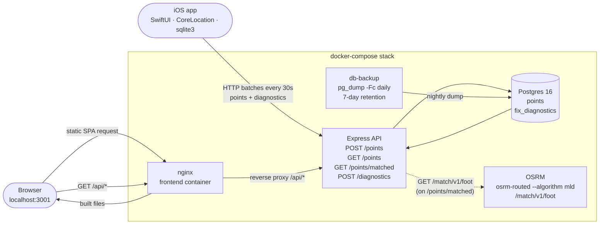

# GpsLogger

Minimal end-to-end GPS tracking system.

> **Design rule:** collect raw location data with **zero interpretation**.
> No trip detection, no movement classification, no behavior analysis —
> just `collect → store → visualize`.

## Parts

| Component | Tech | Purpose |
|---|---|---|
| **iOS app** (`ios/`) | SwiftUI + CoreLocation + CoreMotion + raw sqlite3 | record GPS points for walking, cycling, or motorized transport (activityType hint swapped at runtime via `CMMotionActivityManager`), store locally, sync in batches; second channel uploads raw CLLocation diagnostics for post-hoc anomaly analysis |
| **Backend** (`backend/`) | Node.js 20 + Express 4 + pg | accept point batches and diagnostic batches, query points by time range, serve raw and map-matched traces |
| **DB** | PostgreSQL 16 | two tables: `points` (the visible trace) and `fix_diagnostics` (raw CLLocation fields + filter decision, for debugging) |
| **OSRM** (`osrm/`) | osrm/osrm-backend v5.27 | map-matching service: snaps noisy GPS traces to the OpenStreetMap road/path graph on demand (1.3.0, opt-in via `OSRM_URL`) |
| **Frontend** (`frontend/`) | Vite + React 18 + TypeScript + react-leaflet | visualize a route as a gradient polyline; Raw / Snap-to-roads toggle (1.3.0) |
| **Docker** (`docker-compose.yml`) | docker-compose | one-command backend + DB + OSRM bring-up |

## Data contract

All three tiers agree on a single shape.

### `POST /points`

Body: **raw JSON array** (not an envelope object):

```json
[
  { "latitude": 37.7749, "longitude": -122.4194, "created_at": "2024-01-01T12:00:00.000Z", "device_id": "B1F2…" },
  { "latitude": 37.7750, "longitude": -122.4180, "created_at": "2024-01-01T12:00:05.000Z", "device_id": "B1F2…" }
]
```

Rules:

- `latitude` ∈ `[-90, 90]`, finite number
- `longitude` ∈ `[-180, 180]`, finite number
- `created_at` is an ISO 8601 string in **UTC**
- `device_id` is a non-empty string ≤ 128 chars (stable per install, see iOS `DeviceIdentity`). The iOS app stamps it on the upload payload from a single cached source — it is **not** duplicated into every row of the local SQLite queue.
- batch size ≤ 1000 (iOS app uses ≤ 100)

Response:

```json
{ "inserted": 2, "submitted": 2 }
```

`inserted` is the number of rows that actually landed in the DB, `submitted`
is the batch size. They differ when the backend skips duplicates on the
idempotency key `(device_id, created_at)` — a successful retry of an
already-accepted batch returns `{ "inserted": 0, "submitted": 2 }` without
error. See migration `004_idempotency.sql` and the unique index.

Errors:

```json
{ "error": "points[3].latitude: must be a finite number in [-90, 90]" }
```

### `POST /diagnostics`

Debug/observability channel. Every raw `CLLocation` that enters the iOS
tracker pipeline is uploaded here together with the `LocationFilter`
verdict, for post-hoc classification of GPS anomalies (GNSS vs Wi-Fi /
cell-tower fallback vs sensor-fusion drift). Never read by the main
frontend — queried directly via psql after an incident. See
[`QA.md`](QA.md) for the extraction workflow.

Body: raw JSON array, same envelope shape as `/points`:

```json
[
  {
    "logged_at":         "2026-04-15T17:45:00.000Z",
    "fix_timestamp":     "2026-04-15T17:45:00.000Z",
    "latitude":          39.46975,
    "longitude":         -0.37739,
    "horizontal_accuracy": 8.2,
    "vertical_accuracy":   4.5,
    "altitude":           15.3,
    "speed":               1.3,
    "speed_accuracy":      0.4,
    "course":             92.0,
    "course_accuracy":     5.0,
    "decision":           "accept",
    "device_id":          "B1F2…"
  }
]
```

Rules:

- `latitude` / `longitude` same ranges as `/points`.
- `logged_at` is the wall-clock moment the iOS tracker captured the fix;
  `fix_timestamp` is `CLLocation.timestamp`. Both are ISO 8601 UTC.
- All seven raw CLLocation numeric fields (`horizontal_accuracy`,
  `vertical_accuracy`, `altitude`, `speed`, `speed_accuracy`, `course`,
  `course_accuracy`) must be finite numbers. **Negative values are
  preserved** — they are Apple's documented sentinels for "no data" and
  are the load-bearing signal for classifying network-origin fixes.
- `decision` is the `LocationFilter` verdict tag (e.g. `accept`,
  `discard:nonGpsSource`, `discard:poorAccuracy`, `spikeReplaced`,
  `buffered`), non-empty string ≤ 64 chars.
- `device_id` same rules as `/points`.
- batch size ≤ 1000 (iOS app uses ≤ 100).

Response: `{ "inserted": N, "submitted": M }` with the same idempotency
semantics as `/points` (duplicate `(device_id, fix_timestamp)` rows are
silently skipped). No GET — reads go straight to Postgres.

### `GET /points?device_id=<id>&from=<ISO>&to=<ISO>`

`device_id` is **required** — the endpoint is always scoped to one device so an
unauthenticated caller cannot enumerate the full dataset. `from` and `to` are
optional. Returns an array **sorted ASC by `created_at`**:

```json
[
  { "id": 1, "latitude": 37.7749, "longitude": -122.4194, "created_at": "2024-01-01T12:00:00.000Z" },
  ...
]
```

### `GET /points/matched?device_id=<id>&from=<ISO>&to=<ISO>` (1.3.0)

Same query shape and response envelope as `GET /points`, but every row's
coordinates are snapped to the OpenStreetMap path graph via the OSRM
`/match` endpoint before being returned. The goal is cosmetic-but-
measurable: removing both the Kalman-residual zigzag and the systematic
multipath bias that on-device filtering cannot address, so a rendered
polyline follows the actual sidewalk / road instead of a shape offset
by 10–30 m.

Requires `OSRM_URL` to be set in the backend environment (pointing at a
reachable OSRM service, e.g. `http://osrm:5000` on the compose network).
If unset, the endpoint returns **HTTP 503 `map_matching_disabled`** so
the frontend can disable its toggle instead of silently degrading.

```json
{
  "data": [
    {
      "id": 42,
      "latitude": 39.4847,
      "longitude": -0.3830,
      "created_at": "2026-04-17T16:37:47.975Z",
      "matched": true
    },
    {
      "id": 43,
      "latitude": 39.4848,
      "longitude": -0.3829,
      "created_at": "2026-04-17T16:37:50.123Z",
      "matched": false
    }
  ],
  "truncated": false,
  "matched_count": 1,
  "total_count": 2
}
```

Semantics:

- `data[*].matched = true` → the row carries the snapped lat/lon from
  OSRM. The original coordinates are not echoed; use the raw `/points`
  endpoint if you need them for side-by-side comparison.
- `data[*].matched = false` → OSRM rejected this specific tracepoint
  (low confidence, off-graph, or part of a single-point segment with
  nothing to match against), and the raw coordinates are echoed so the
  rendered polyline stays continuous.
- `matched_count` / `total_count` — aggregate snap ratio so the UI can
  display "*N / M snapped to roads*" without scanning the array.

Implementation:

- Points are split into trip segments on any inter-sample gap > 5 min
  (matching the frontend's existing polyline-split rule), because
  OSRM's HMM assumes a continuous trace.
- Within each trip, further split into OSRM requests of ≤ 100 points
  with a 1-point overlap so each batch after the first has a warm HMM
  seed. Typical walking sessions fit into one OSRM call.
- Per-point `radius = 25 m` (uniform). The `points` table doesn't
  carry `horizontal_accuracy` — a future optimization is a JOIN on
  `fix_diagnostics(device_id, fix_timestamp)` for per-row radius.
- Profile is `foot` (see `osrm/prepare.sh`). Multi-modal profile
  selection is a future feature; `foot` is a safe default because
  walker-accessible paths are a superset of what a city phone trace
  actually touches.
- Degradation on error: an unreachable OSRM, a non-2xx response, or a
  network timeout (`OSRM_TIMEOUT_MS = 15 s` per chunk) collapses into
  raw-echo for that chunk. The endpoint never throws at the caller.

### Schema

```sql
-- 001_init.sql
CREATE TABLE points (
    id          SERIAL PRIMARY KEY,
    latitude    DOUBLE PRECISION NOT NULL,
    longitude   DOUBLE PRECISION NOT NULL,
    created_at  TIMESTAMPTZ      NOT NULL
);
CREATE INDEX idx_points_created_at ON points (created_at);

-- 002_device_id.sql
ALTER TABLE points
    ADD COLUMN IF NOT EXISTS device_id TEXT NOT NULL DEFAULT '';
CREATE INDEX IF NOT EXISTS idx_points_device_id_created_at
    ON points (device_id, created_at);

-- 004_idempotency.sql (after 003; declared out of order here for clarity)
-- Removes any pre-existing duplicates, then creates a unique index so
-- that retried-after-lost-response batches are idempotent.
CREATE UNIQUE INDEX idx_points_unique_device_created
    ON points (device_id, created_at);
CREATE UNIQUE INDEX idx_fix_diagnostics_unique_device_fix
    ON fix_diagnostics (device_id, fix_timestamp);

-- 003_fix_diagnostics.sql
CREATE TABLE fix_diagnostics (
    id                  SERIAL PRIMARY KEY,
    logged_at           TIMESTAMPTZ      NOT NULL,
    fix_timestamp       TIMESTAMPTZ      NOT NULL,
    latitude            DOUBLE PRECISION NOT NULL,
    longitude           DOUBLE PRECISION NOT NULL,
    horizontal_accuracy DOUBLE PRECISION NOT NULL,
    vertical_accuracy   DOUBLE PRECISION NOT NULL,
    altitude            DOUBLE PRECISION NOT NULL,
    speed               DOUBLE PRECISION NOT NULL,
    speed_accuracy      DOUBLE PRECISION NOT NULL,
    course              DOUBLE PRECISION NOT NULL,
    course_accuracy     DOUBLE PRECISION NOT NULL,
    decision            TEXT             NOT NULL,
    device_id           TEXT             NOT NULL
);
CREATE INDEX idx_fix_diagnostics_device_fix_timestamp
    ON fix_diagnostics (device_id, fix_timestamp);
```

Notes:
- `TIMESTAMPTZ` (not `TIMESTAMP`) so values round-trip correctly through `pg`
  regardless of container timezone.
- The composite `(device_id, created_at)` index covers the primary read
  pattern for points: `WHERE device_id = ? AND created_at BETWEEN ? AND ? ORDER BY created_at ASC`.
- The `(device_id, fix_timestamp)` index on `fix_diagnostics` covers the
  incident-investigation read: `WHERE device_id = ? AND fix_timestamp
  BETWEEN ? AND ? ORDER BY fix_timestamp`.
- `device_id` on `points` ships with `DEFAULT ''` so the `002` migration is
  non-blocking on a populated table; new rows must supply a non-empty value
  (enforced at the API layer).
- `fix_diagnostics` has no default on `device_id` because the iOS client
  always supplies it. Raw CLLocation columns are `DOUBLE PRECISION NOT NULL`
  without range constraints — negative values are Apple's sentinels for
  "no data" and are exactly what we need to preserve.

### Data retention

The backend ships **no automated retention**. Both `points` and
`fix_diagnostics` grow without bound. This is a conscious decision, not an
oversight:

- **Volume is manageable.** With aggressive client-side filtering (three
  gates in `LocationFilter`, stationary suppression) a daily-active single
  user produces ~1–5 k points/day, or a few million rows per year.
  Postgres + the composite `(device_id, created_at)` index handle that
  comfortably on any reasonable host.
- **History belongs in backups, not tables.** The `db-backup` sidecar
  (see `docker-compose.yml`) runs `pg_dump -Fc` every 24 h and keeps
  seven days of dumps in the `db-backup` named volume. Long-term history
  lives there; the hot tables carry only what's currently useful.
- **Pruning is a deployment choice.** If a specific operator needs to
  cap growth, the natural pattern is a time-range `DELETE` on
  `fix_diagnostics` first (debug-only, no UI dependency), then on
  `points` only if unavoidable. No migration ships to do this
  automatically — the decision about what to keep is per-deployment.

The **iOS device's local SQLite is different**: `fix_diagnostics` rows
are pruned after 3 days (`cleanupDiagnostics`), and `points` rows are
deleted immediately after a successful 2xx upload to `/points`. The
on-device DB is a staging buffer, not a store of record; the backend
Postgres is authoritative for everything.

## Running it

### 1. Full stack via Docker Compose (recommended)

```bash
docker compose up --build
```

Brings up five services:

| Service | Host port | Purpose |
|---|---|---|
| **db** | `5434` (→ container `5432`) | Postgres 16, data in the `db` named volume |
| **db-backup** | — | Sidecar that runs `pg_dump -Fc` into the `db-backup` named volume once every 24 h with 7-day retention (`find -mtime +7 -delete`). `tmpfs` mounted over `/var/lib/postgresql/data` to avoid Docker creating an anonymous volume for the postgres image's declared VOLUME |
| **osrm** | `5000` | OSRM map-matching engine. First boot downloads the Spain OSM extract (~800 MB) and runs the MLD preparation pipeline (`osrm-extract` + `osrm-partition` + `osrm-customize`, ~15–30 min CPU) into the `osrm-data` named volume; subsequent starts skip the prep via a `.mldgr` completion marker. Serves the `/match/v1/foot` endpoint consumed by the backend's `GET /points/matched`. Override `OSRM_REGION_URL` to switch regions without rebuilding |
| **backend** | `3000` | Express API |
| **frontend** | `3001` | nginx serving the built SPA + `/api/*` reverse proxy to `backend:3000` |

Wait for:

```
[migrate] applied 001_init.sql
[api] listening on :3000
```

Sanity checks:

```bash
curl -fsS http://localhost:3000/health            # backend direct  → {"ok":true}
curl -fsS http://localhost:3001/                  # frontend index  → HTML
curl -fsS 'http://localhost:3001/api/points?device_id=demo&from=2000-01-01T00:00:00Z&to=2100-01-01T00:00:00Z'
#                                                  # frontend → nginx → backend → []
```

Then open **http://localhost:3001** in your browser. The UI has a **Device ID**
field (persisted in `localStorage`), a **From**/**To** datetime pair, a
**Visualize** button, and a **Logout** button that clears the stored device ID
and resets the view. No auto-refresh.

### 2. Frontend in dev mode (optional)

For hot-reload while working on the frontend, run the Vite dev server directly
against the dockerized backend:

```bash
cd frontend
npm install
npm run dev
```

Open http://localhost:5173. The dev server defaults to `http://localhost:3000`
for the API; override via `frontend/.env` if needed:

```
VITE_API_URL=http://localhost:3000
```

### 3. iOS app

See [`ios/README.md`](ios/README.md) for full Xcode setup steps (project creation,
Info.plist keys, background-mode capability, free Apple ID signing).

Short version (xcodegen-based build from the CLI):

1. `cp ios/GpsLogger.xcconfig.example ios/GpsLogger.xcconfig`
2. Edit `ios/GpsLogger.xcconfig` and fill in two values:
   - `DEVELOPMENT_TEAM` — your Apple Team ID
     (`security find-identity -p codesigning -v`).
   - `API_BASE_URL` — your Mac's LAN IP (`ipconfig getifaddr en0`),
     e.g. `http:/$()/192.168.1.129:3000`. The `$()` is an empty
     variable expansion that escapes `//` from xcconfig comment
     parsing — after expansion the value is the plain URL
     `http://192.168.1.129:3000`. iPhone and Mac must share the same
     Wi-Fi.
3. `cd ios && xcodegen generate`
4. Open the generated `GpsLogger.xcodeproj` in Xcode, pick your
   iPhone in the device picker, hit **Run**. First time: on the
   iPhone, go to Settings → General → VPN & Device Management and
   trust the developer profile.
5. Verify the URL landed in the build:
   ```
   plutil -p ~/Library/Developer/Xcode/DerivedData/GpsLogger-*/Build/Products/Debug-iphoneos/GpsLogger.app/Info.plist | grep API_BASE_URL
   ```

See [`ios/README.md`](ios/README.md) for full details on the xcodegen +
CLI install path via `devicectl`, the free Apple ID 7-day provisioning
lifetime, and the `Config.apiBaseURL` resolution chain.

## Architecture summary



### iOS — collection rules

- **Always-on tracker.** There is no Start/Stop button — `LocationTracker`
  starts in `AppContainer.init` and runs for the lifetime of the app. The UI
  shows a pulsing green dot when active and an unsynced-points counter.
- **Only** `CLLocationManager` drives point collection — the app uses **no
  timers for location**. Points are inserted exclusively in the
  `didUpdateLocations` callback. A `Timer` exists, but only inside
  `SyncService`, to schedule HTTP uploads.
- **Multi-modal `activityType`.** A single install tracks walking,
  cycling, and motorized transport (car, bus, train) with the right
  CoreLocation hint for each mode. `MotionClassifier` wraps
  `CMMotionActivityManager` — which reads the phone's inertial sensors,
  not GPS speed — and emits a coarse mode (`.pedestrian`, `.cycling`,
  `.automotive`, `.unknown`) that `LocationTracker` maps to
  `CLLocationManager.activityType`: `.fitness` for pedestrian/cycling,
  `.automotiveNavigation` for any motor vehicle. Startup default is
  `.fitness`, so a fresh launch behaves exactly like a pedestrian
  tracker; the hint flips only on medium/high-confidence readings, and
  low-confidence or `stationary` readings do not change the hint
  (prevents thrashing). Requires the **Motion & Fitness** permission —
  if denied or restricted, the classifier emits an `onUnavailable`
  signal and the tracker surfaces a `motionPermissionDenied`
  impairment banner in the UI; the app stays on `.fitness` permanently
  until the permission is restored. The source gate in `LocationFilter`
  is the real defense against bad GPS regardless of mode —
  `activityType` only biases CoreLocation's fusion, it does not by
  itself accept or reject fixes.
- **Tracking impairment UI.** `LocationTracker` publishes a
  `Set<TrackingImpairment>` that surfaces three degraded states as an
  orange banner at the top of `ContentView`: `.permissionDenied` (no
  tracking at all), `.backgroundRequiresAlways` (user has WhenInUse
  only — foreground tracks fine but background silently drops), and
  `.motionPermissionDenied` (vehicle mode never engages, stays on
  `.fitness`). The state machine in
  `locationManagerDidChangeAuthorization` also resets `LocationFilter`
  and `StationaryDetector` when permission is restored after a denial,
  so stale anchors from the old session don't bleed into the new one.
- **Correctness + resilience hardening** (1.2.1):
  - `Database.insert` and `Database.logDiagnostic` return `Bool`;
    `LocationTracker` only increments the in-memory unsynced counter
    on confirmed SQLite success, so disk-full or schema-mismatch
    failures can no longer drift the UI counter off the real row count.
  - Both the database-write path and the sync-drain path hop onto
    private serial queues (`persistQueue` in `LocationTracker`,
    `syncQueue` in `SyncService`), so the main thread never blocks on
    synchronous SQLite reads/writes and the `in-flight` Bool flags
    live on a single serial owner instead of racing between the main
    `Timer` callback and the URLSession background completion.
  - `LocationFilter` drops a stale `pending` spike if it has aged past
    `Config.pendingTimeoutSeconds` (30 s), preventing a buffered fix
    from surviving an app backgrounding and corrupting the next
    session's filter state.
  - `StationaryDetector` guards against a negative `age` computed from
    an older anchor timestamp (NTP correction, DST transition, cached
    replay) and resets the candidate instead of stalling forever in
    Phase A.
- **Post-indoor GPS reacquisition defense** (1.2.2):
  - `LocationFilter` rejects cached CoreLocation fixes whose timestamp
    is more than 10 s behind wall-clock time (stale-delivery gate).
  - After a gap > 60 s between accepted fixes, the accuracy ceiling
    tightens from 50 m to 20 m, filtering multipath convergence fixes
    that report optimistic `horizontalAccuracy` after extended indoor
    or background signal loss (gap-aware accuracy gate).
  - `locationManager(_:didFailWithError:)` now switches on `CLError.code`:
    `.denied` stops the tracker and surfaces a permission impairment,
    `.locationUnknown` is ignored as transient, the rest is logged
    only under DEBUG.
- **Silent-failure detectors** (1.2.8):
  Three classes of "the app looks fine, nothing is being recorded"
  scenarios now surface as impairment banners instead of failing
  quietly — all motivated by Apple Developer Forum reports and the
  WWDC23/24 Core Location sessions.

  - **Reduced-accuracy detection** (iOS 14+). When the user grants
    "Always" but toggles Precise Location off, `horizontalAccuracy`
    reports on the 1–20 km scale and our 50 m filter ceiling rejects
    every fix. `LocationTracker` now checks
    `CLLocationManager.accuracyAuthorization` on every authorization
    transition and adds `TrackingImpairment.reducedAccuracy` when it's
    `.reducedAccuracy`, so the user sees a banner instead of a silent
    empty trace.
  - **Background App Refresh impairment.** Force-quit recovery via
    `startMonitoringSignificantLocationChanges` requires Background
    App Refresh to be on (globally in Settings > General and per-app).
    `LocationTracker` subscribes to
    `UIApplication.backgroundRefreshStatusDidChangeNotification` and
    surfaces `TrackingImpairment.backgroundRefreshDenied` when it is
    not `.available`, explaining why tracking disappeared after a
    recent force-quit.
  - **`didPauseLocationUpdates` / `didResume` delegate.** Apple docs
    say these are not called when `pausesLocationUpdatesAutomatically
    = false`, but production reports show the system still pauses on
    rare OS/device combinations. The delegate methods now log the
    event and re-issue `startUpdatingLocation()` on pause, so a
    silent iOS-driven pause recovers on its own instead of running
    out the foreground-Timer clock.
  - Pure static mapping helpers
    `TrackingImpairment.impairment(for: CLAccuracyAuthorization)` and
    `impairment(for: UIBackgroundRefreshStatus)` keep the
    classification logic unit-testable without mocking
    `CLLocationManager` or `UIApplication`. 7 new tests in
    `TrackingImpairmentTests`.

- **High-density sampling + Kalman smoother** (1.2.7):
  - `CLLocationManager.desiredAccuracy` promoted from `kCLLocationAccuracyBest`
    to `kCLLocationAccuracyBestForNavigation`. Under partial-sky conditions
    (urban canyon, tree canopy) the fusion engine pulls in more inertial
    data and the reported `horizontalAccuracy` collapses from 32 m
    buckets toward 10–16 m. Battery impact is real (Apple flags this mode
    as "while plugged in / navigating"); accepted trade for continuous
    high-fidelity tracking.
  - `CLLocationManager.distanceFilter` set to `kCLDistanceFilterNone`
    so every computed fix is delivered (~1 Hz) rather than only those
    farther than 10 m from the last one. Row rate in the `points` table
    is unchanged — `LocationFilter.minDistance` still gates persistence
    at 10 m — but the downstream smoother now sees 5–7× more
    observations per persisted point.
  - New `KalmanSmoother` module: 2D constant-velocity Kalman filter
    layered between `LocationFilter.accept` and
    `StationaryDetector.consume`. State: `[x, y, vx, vy]` in local ENU
    meters anchored at the first accepted fix. Process noise σ_a = 2 m/s²
    (multi-modal: covers walking, cycling, typical-driving accelerations).
    Measurement noise R = CLLocation's own `horizontalAccuracy`² — the
    filter trusts Apple's per-sample quality estimate as-is. Resets on
    `dt > 10 s` (stale velocity estimate) or non-positive `dt`
    (out-of-order / duplicate delivery). Output `CLLocation` preserves
    altitude / vertical accuracy / speed / course from the input and
    reports the post-update position-variance RMS as the new
    `horizontalAccuracy`, which is strictly ≤ the input after a few
    updates. 7 unit tests cover first-fix passthrough, accuracy
    improvement, zigzag smoothing, spike damping, long-gap reset,
    out-of-order reset, and ENU round-trip.
  - `StationaryDetector` false-positive after GPS blackout fixed. Prior
    behavior (observed in the 2026-04-17 18:34–18:55 CEST session):
    a 5-minute GNSS blackout during which `LocationFilter` rejected
    every raw sample left the candidate anchor from the pre-gap fix
    untouched; the first returning fix landed with `age >> windowSeconds`
    and was suppressed as stationary-jitter, losing 4 real movement
    points at 18:45:06–18:45:31. New gap-reset guard tracks the
    timestamp of the most recent processed fix and, when the
    inter-sample gap exceeds `Config.resumeGapSeconds` (60 s), treats
    the returning fix as a fresh candidate anchor and clears any
    cached stationary center. Symmetric to the reset logic already
    present in `LocationFilter.pending`. Regression test covers both
    the Phase-A (candidate-only) and Phase-B (stationary-declared)
    variants of the bug.
- **Filter deadlock escape valve** (1.2.6):
  - Gap-aware accuracy gate changed from two-tier (normal ≤ 60 s / tight
    forever) to three-tier (normal ≤ 60 s / tight 60–120 s / relaxed
    > 120 s). Fixes a self-reinforcing deadlock observed in the
    2026-04-16 production session where a 60 s tram-tunnel signal dip
    cascaded into a 17-minute accepted-fix blackout: every new fix
    landed in the 20–50 m band, the gate stayed tight, `dt` kept
    growing, and the receiver never produced a sub-20 m fix while the
    user was under marginal signal. At `dt > 120 s` the ceiling now
    falls back to the normal 50 m, bounding the worst case at two
    minutes instead of seventeen. Multipath convergence defense for the
    typical 30–90 s post-indoor reacquisition is unchanged.
  - `LocationTracker` counts consecutive discards; every 20 rejections
    in a row emits an unconditional `[tracker] WARN: N consecutive
    discards` line so compound deadlocks are visible in Console.app
    without needing the `fix_diagnostics` Postgres query.
  - `LocationTracker` now also subscribes to
    `startMonitoringSignificantLocationChanges` as a secondary wake
    path. SLC is cellular-triangulation powered (no extra GPS radio
    cost), fires on ~500 m displacements, and relaunches the app via
    `UIApplicationLaunchOptionsLocationKey` even from terminated state.
    Defense in depth for genuine iOS-kill scenarios where regular
    background location updates alone won't resurrect the tracker.
- **GPS audit follow-ups** (1.2.5):
  - Stale-delivery gate is now symmetric: `abs(delivery_age) > 10 s`
    rejects both cached replays (timestamp behind wall-clock) and
    fixes whose timestamp is ahead of wall-clock, which happens on
    system-clock skew backward (NTP correction, manual time change,
    DST edge). Both directions produce a fix that cannot be placed
    on a coherent timeline against the anchor `LocationFilter` already
    holds.
  - `LocationTracker.didUpdateLocations` sorts the incoming
    `[CLLocation]` array by timestamp before processing. Apple
    documents the array as already ordered, but the spike-buffer and
    chronology gates are correctness-sensitive to order — sorting
    defensively protects against any future iOS change in array
    semantics, at zero cost (the array is almost always 1–3 elements).
  - First-fix short-circuit in `LocationFilter` is now explicitly
    documented: a multi-hour app relaunch is a first fix, not a first
    fix *after gap*, so the gap-aware accuracy gate is bypassed by
    design. The load-bearing checks (stale-delivery, validity, source,
    50 m accuracy ceiling) have already run, so the fix is still
    guaranteed to be GNSS-origin, non-cached, and within the normal
    accuracy bound.
- **Background sync + error-aware backoff** (1.2.4):
  - `GpsLoggerApp` registers a `BGAppRefreshTask`
    (`com.gpslogger.personal.refresh`) and submits a new request on
    every background scenePhase transition. When iOS wakes the app the
    handler calls `SyncService.drainOnce` and re-submits, so the local
    upload queue drains even when the foreground `Timer` is suspended
    (stationary phone, long indoor stop, airplane-mode recovery). Paired
    Info.plist entries (`UIBackgroundModes += fetch`,
    `BGTaskSchedulerPermittedIdentifiers`) are declared in `project.yml`.
  - HTTP outcomes are classified into a `SyncResult` enum: 2xx →
    `.success`, network errors / 408 / 429 / 5xx → `.retryable`
    (exponential backoff doubles up to 5 min), every other 4xx →
    `.nonRetryable` (batch retained, loud release-build log, interval
    held steady so a client bug — schema drift, rotated key,
    misconfigured URL — surfaces within seconds instead of being masked
    behind a 5 min cadence).
  - `NWPathMonitor` short-circuits the drain when the device has no
    usable network, replacing the previous 15 s URLSession-timeout spin
    in airplane mode / captive portals with a fast no-op skip.
  - Fetch → upload → delete is now explicitly documented as
    non-atomic: a crash between a 2xx and the local `DELETE` replays
    the batch, and the backend's unique `(device_id, created_at)` /
    `(device_id, fix_timestamp)` constraints from migration 004 absorb
    the replay. Any future weakening of those constraints must also
    introduce a two-phase commit on the iOS side.
  - `Database` sets `PRAGMA synchronous=NORMAL` explicitly alongside
    WAL mode so the crash-safety posture is reviewable in code rather
    than implicit in the iOS SQLite default.
- **Distance filter (first gate).** `CLLocationManager.distanceFilter` is
  set to `kCLDistanceFilterNone` (1.2.7) so `KalmanSmoother` sees every
  raw fix, but `LocationFilter.minDistance = 10 m` still enforces the
  10 m gate on what gets persisted — the `points` table still holds
  rows spaced ≥ 10 m apart.
- **`LocationFilter` (second gate, GPS noise).** Rules applied in order:
  0. **Delivery age** (1.2.2, symmetric in 1.2.5) — `|now − timestamp| ≤ 10 s`.
     CoreLocation may replay cached locations after a signal gap; Apple's
     documentation explicitly recommends checking fix age. Rejects stale
     cached fixes before any other gate runs. The 1.2.5 symmetric variant
     also rejects fixes whose timestamp is *ahead* of wall-clock, which
     happens on system-clock skew backward (NTP correction, manual time
     change, DST edge).
  1. Validity — `horizontalAccuracy ≥ 0`.
  2. **Source discrimination** — `speed ≥ 0` AND `verticalAccuracy > 0`.
     GNSS fixes populate both (Doppler velocity + 3D solution); Wi-Fi /
     cell-tower fallback fixes leave them at the documented sentinel
     negatives because network positioning has neither velocity nor
     altitude. This is the load-bearing defense against the "park-canopy
     teleport" anomaly where CoreLocation falls back to Wi-Fi Positioning
     and a stale BSSID registration delivers a plausible-looking fix
     hundreds of meters to kilometers off the true position. Accuracy
     gating alone cannot catch it.
  3. Accuracy value — drops fixes with `horizontalAccuracy > 50 m`.
  4. Chronology — `Δt > 0` vs. the last accepted fix (rejects replayed /
     cached fixes).
  4b. **Gap-aware accuracy** (1.2.2, three-tier in 1.2.6) — if
     `Δt > 60 s`, tightens the accuracy ceiling from 50 m to 20 m.
     After extended signal loss (indoor, tunnel, background) the GPS
     receiver's first convergence fixes are disproportionately likely
     to suffer multipath displacement despite reporting optimistic
     `horizontalAccuracy`. **1.2.6 escape valve**: if `Δt > 120 s` the
     ceiling falls back to the normal 50 m so sustained marginal signal
     cannot self-reinforce into a multi-minute blackout (see the 1.2.6
     hardening subsection above).
  5. Speed ceiling — rejects implied speeds > 500 km/h (teleport-class
     glitches only; every real surface transport mode passes).
  6. Spike buffer — a fix > 750 m from the last accepted point is held one
     tick. If the next fix returns within 100 m of the last accepted point,
     the buffered point is confirmed as a spike and dropped
     (A → B(far) → C(near A)).
  7. Minimum distance — ≥ 10 m from the last accepted fix.
- **`KalmanSmoother` (third stage, jitter smoothing).** Layered between
  `LocationFilter.accept` and `StationaryDetector.consume`. 2D
  constant-velocity Kalman filter in local ENU meters; uses CLLocation's
  own `horizontalAccuracy` as measurement σ and a 2 m/s² process-noise
  acceleration σ tuned for multi-modal use (walking, cycling, driving).
  Resets on `dt > 10 s` so velocity state never carries across a GPS
  blackout. Output coordinates flow on to `StationaryDetector` and the
  `points` table; `fix_diagnostics` still records the raw CLLocation so
  filter debugging is unaffected.
- **`StationaryDetector` (fourth gate, jitter clusters).** After accepted
  fixes stay within 20 m of a candidate anchor for 150 s, the user is
  declared stationary and subsequent fixes are dropped until one lands more
  than 30 m from the cluster center (10 m of hysteresis). A 1.2.7
  gap-reset guard invalidates the candidate / stationary state when the
  inter-sample gap exceeds 60 s, so a GNSS blackout cannot be
  reinterpreted as sustained stationarity. Coordinates are never smoothed
  or averaged *inside this stage* — smoothing happens upstream in
  `KalmanSmoother` — and `LocationFilter.lastAccepted` keeps advancing so
  the spike/speed gates stay sane across long stationary windows.
- **Diagnostic channel.** Every raw `CLLocation` that enters
  `didUpdateLocations` — *before* the filter, not just accepted ones — is
  written to a local `fix_diagnostics` table with the filter verdict, then
  uploaded on the same 30 s sync tick to `POST /diagnostics`. The local
  copy is deleted on successful 2xx and a 3-day retention window covers
  backend outages. Used for post-hoc anomaly classification; the
  authoritative store is the backend Postgres table. See
  [`QA.md`](QA.md) for the query workflow.
- **Persistent device identity.** `DeviceIdentity` mints a UUID on first
  launch and stores it in the Keychain (UserDefaults fallback), so the
  same ID survives reinstalls. The ID is owned by `SyncService` and
  stamped on every upload payload from a single cached source — it is
  **not** written into individual rows of the local SQLite. Shown in the
  UI with a copy button.
- **Unsynced counter** lives in memory: seeded once at launch via
  `SELECT COUNT(*)`, then incremented/decremented only. No further count queries.

### Backend — minimalism

- Four routes + health endpoint: `POST /points`, `GET /points`,
  `GET /points/matched` (1.3.0), `POST /diagnostics`. No envelopes, no
  extra layers. Optional `API_KEY` bearer-token auth gates the two
  POST routes — compared with `crypto.timingSafeEqual` so the key
  prefix doesn't leak through a response-time side channel.
  `GET /health`, `GET /points`, and `GET /points/matched` are
  unprotected so the frontend and Docker healthcheck keep working
  without a token.
- `GET /health` runs `SELECT 1` against the pool and returns 503 on
  failure, so the Docker healthcheck reflects actual DB reachability,
  not just process liveness.
- Parameterized multi-row `INSERT` for O(1) round-trips per batch on
  both write endpoints. `ON CONFLICT DO NOTHING` on the natural
  idempotency keys turns retried-after-lost-response batches into
  no-ops (see migration `004_idempotency.sql`).
- Range query is a single `SELECT … WHERE device_id = ? AND created_at
  BETWEEN` against the composite `(device_id, created_at)` index.
  Results are capped at 10 001 rows and the response includes a
  `truncated` flag so the client can narrow the range.
- Structured logging via `pino` with per-request correlation IDs:
  inbound `X-Request-ID` is honored if present, else a UUID v4 is
  minted and echoed back on the response. Every downstream log line
  carries `reqId` so cross-hop trace stitching is free.
- Graceful shutdown on `SIGTERM` / `SIGINT`: stops the HTTP listener,
  drains the pg pool, exits — with an 8 s hard deadline fallback so
  Docker never has to escalate to `SIGKILL` on a clean restart.
- No `GET /diagnostics` — diagnostics are read via psql / a DB browser
  against Postgres directly, not through the API, because they're a
  debug/observability channel and the frontend never displays them.
- Pure-function input validators with a dedicated unit-test suite
  (35 tests covering `validateBatch`, `validateDiagnosticsBatch`, and
  `validateRange`).
- **Map-matching (1.3.0).** `GET /points/matched` runs the same
  range-scan as `GET /points` and then pipes the result through
  `src/matcher.js`, which batches the trace by ≤ 5 min trip gaps and
  ≤ 100-point OSRM chunks (1-point overlap for HMM warm-seeding),
  calls OSRM's `/match/v1/foot` with per-point radiuses + timestamps,
  and stitches the snapped coordinates back in input order. Any
  tracepoint OSRM rejects falls back to the raw coord so the rendered
  polyline is continuous. The endpoint returns **503
  `map_matching_disabled`** when `OSRM_URL` is unset, so the frontend
  can self-disable its toggle. 24 unit tests cover the pipeline end
  to end with an injected `fetchImpl` so no live OSRM is required.

### Frontend — visualization

- User-driven fetch only. **No auto-refresh, no clustering, no heatmap.**
- **Query range in URL.** The `from`/`to` datetime selectors round-trip
  through `URLSearchParams` (ISO UTC, `history.replaceState` so history
  stays clean), so reloading the page or sharing the link hydrates the
  same range. Device ID stays in `localStorage` because it's identity,
  not query state; Logout clears both.
- Splits the time-sorted points into groups whenever consecutive fixes
  are more than **5 minutes** apart, so unrelated trips (or power-off
  periods) never get bridged by a straight "teleport" line.
- Downsamples each group with a shared global budget of ≤ 4000 points
  total, always preserving the first and last fix of each group.
- Groups of ≥ 2 points render as a halo + gradient polyline; groups of
  a single point render as standalone `CircleMarker`s (1.2.4) so an
  isolated fix in a sparse tracking window doesn't silently disappear
  between the status-bar count and the map.
- Gradient `t` stays global across groups so colors track progression
  across the full query window (blue early → red late). Each polyline
  is split into up to 64 colored chunks to fake a gradient under
  Leaflet's single-color-per-polyline limitation.
- **Direction-of-travel arrows** (1.3.1): a small semi-transparent
  chevron every ~150 m along each polyline group, oriented to the
  segment's bearing, so direction reads instantly at any zoom
  regardless of the gradient colors. Computed in meters along the
  geodesic (`route.arrowsAlong`) so spacing is zoom-invariant; the
  first and last arrows keep a half-interval clear of the endpoints
  so they don't collide with the Start / End markers. Rendered via
  `L.divIcon` SVG with `pointer-events: none` so clicks flow through
  to the polyline.
- **Start / End markers** (1.3.1): green "S" and red "E" pins on
  distinct circular badges with drop-shadow, plus `Start` / `End`
  tooltips, replacing the earlier same-shape white-filled circles.
  Fixes the "I can't tell where the route starts" feedback that the
  blue-fill vs. red-border treatment could not address on a light
  basemap.
- Clicks snap to the nearest rendered point in **screen-pixel space**
  via `map.latLngToContainerPoint` (30 px radius), so the snap behavior
  stays consistent at every zoom level — the previous degree-based
  radius was ~1 km regardless of zoom and felt erratic at the extremes.
- `fitBounds` on every successful fetch.
- Nginx serves the built SPA with a locked-down CSP,
  `X-Frame-Options: DENY`, `X-Content-Type-Options: nosniff`, and
  `Referrer-Policy: no-referrer-when-downgrade` (see
  `frontend/nginx.conf`). Only `nominatim.openstreetmap.org` and the
  CARTO / OpenStreetMap tile hosts are whitelisted for outbound
  connections.

## Tests

```bash
# backend unit tests (59 cases: validateBatch + validateDiagnosticsBatch +
# validateRange + matcher pipeline end-to-end with injected fetchImpl)
cd backend && node --test test/

# frontend unit tests (29 cases covering splitByTimeGaps, downsampleGroups,
# gradientColor, buildSegments, and arrowsAlong — the pure functions
# behind the route view)
cd frontend && npm test

# iOS unit tests (68 cases across LocationFilter, KalmanSmoother,
# TrackingImpairment mappings, Database drain, MotionClassifier classify,
# and StationaryDetector state machine)
cd ios && xcodegen generate && xcodebuild test \
    -project GpsLogger.xcodeproj \
    -scheme GpsLoggerTests \
    -destination 'platform=iOS Simulator,name=iPhone 17'
```

Full QA plan (smoke tests + manual E2E scenarios + `fix_diagnostics`
query workflow after an anomaly): see [`QA.md`](QA.md).

## Layout

```
GpsLogger/
├── README.md                this file
├── QA.md                    test plan + fix_diagnostics query workflow
├── docker-compose.yml       db + db-backup + osrm + backend + frontend
├── osrm/                    1.3.0 map-matching service
│   ├── prepare.sh           idempotent OSM extract download + MLD pipeline
│   └── entrypoint.sh        prepare-then-serve wrapper for osrm-routed
├── backend/
│   ├── Dockerfile
│   ├── package.json
│   ├── migrations/
│   │   ├── 001_init.sql
│   │   ├── 002_device_id.sql
│   │   ├── 003_fix_diagnostics.sql
│   │   ├── 004_idempotency.sql
│   │   └── 005_cleanup.sql
│   ├── src/{index,db,log,validate,matcher}.js
│   ├── src/routes/{points,diagnostics}.js
│   └── test/{validate,matcher}.test.js
├── frontend/
│   ├── Dockerfile           multi-stage: Node build → nginx serve
│   ├── nginx.conf           static files + /api/* proxy to backend
│   ├── .dockerignore
│   ├── package.json
│   ├── vite.config.ts
│   ├── index.html
│   └── src/
│       ├── {main,App,Map}.tsx
│       ├── {api,route,vite-env.d}.ts
│       ├── route.test.ts                pure-function vitest suite
│       └── styles.css
└── ios/
    ├── README.md                     Xcode setup guide
    ├── project.yml                   xcodegen spec (main + test target)
    ├── GpsLogger.xcconfig.example    template for local signing config
    ├── GpsLogger/
    │   ├── GpsLoggerApp.swift
    │   ├── AppContainer.swift
    │   ├── AppState.swift
    │   ├── ContentView.swift
    │   ├── LocationTracker.swift     delegate, pipeline, diagnostic logging, runtime activityType swap
    │   ├── LocationFilter.swift      validity → source → accuracy → speed → spike
    │   ├── KalmanSmoother.swift      2D constant-velocity KF over accepted fixes
    │   ├── StationaryDetector.swift  jitter-cluster suppression + gap-reset guard
    │   ├── MotionClassifier.swift    CMMotionActivityManager wrapper, emits transport mode
    │   ├── DeviceIdentity.swift      Keychain-backed UUID
    │   ├── SyncService.swift         points + diagnostics drains
    │   ├── Database.swift            points + fix_diagnostics store
    │   ├── Config.swift
    │   ├── GpsLogger.entitlements
    │   └── Info.plist
    └── GpsLoggerTests/
        ├── LocationFilterTests.swift       26 cases covering every filter gate + pending-timeout + deadlock-escape
        ├── KalmanSmootherTests.swift        7 cases covering first-fix passthrough, noise attenuation, outlier damping, reset paths, ENU round-trip
        ├── DatabaseTests.swift              7 cases locking in the drain/retention invariants
        ├── MotionClassifierTests.swift     10 cases for the pure classification rules
        ├── StationaryDetectorTests.swift   11 cases for the Phase-A/B state machine + clock-skew guard + gap-reset
        └── TrackingImpairmentTests.swift    7 cases covering the 1.2.8 silent-failure mappings (accuracyAuthorization, backgroundRefreshStatus, shortMessage sanity)
```
