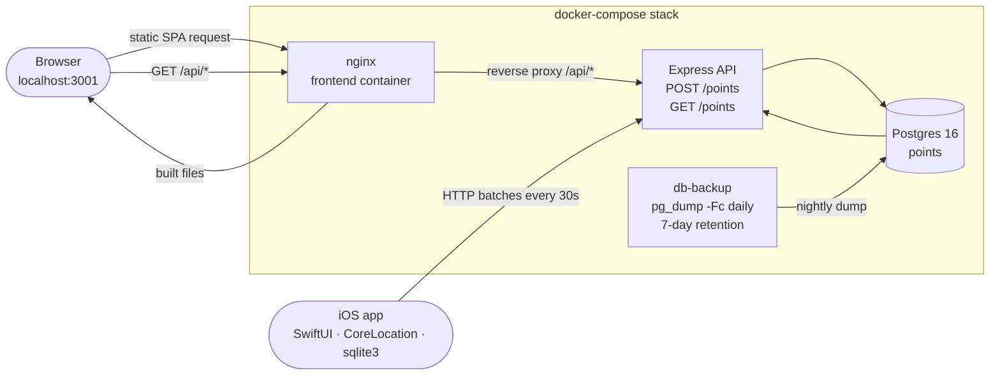

# GpsLogger

Minimal end-to-end GPS tracking system.

> **Design rule:** collect raw location data with **zero interpretation**.
> No trip detection, no movement classification, no behavior analysis —
> just `collect → store → visualize`.

## Parts

| Component | Tech | Purpose |
|---|---|---|
| **iOS app** (`ios/`) | SwiftUI + CoreLocation + raw sqlite3 | record GPS points, store locally, sync in batches |
| **Backend** (`backend/`) | Node.js 20 + Express 4 + pg | accept batches, query by time range |
| **DB** | PostgreSQL 16 | single `points` table with `created_at` index |
| **Frontend** (`frontend/`) | Vite + React 18 + TypeScript + react-leaflet | visualize a route as a gradient polyline |
| **Docker** (`docker-compose.yml`) | docker-compose | one-command backend + DB bring-up |

## Data contract

All three tiers agree on a single shape.

### `POST /points`

Body: **raw JSON array** (not an envelope object):

```json
[
  { "latitude": 37.7749, "longitude": -122.4194, "created_at": "2024-01-01T12:00:00.000Z", "device_id": "B1F2…" },
  { "latitude": 37.7750, "longitude": -122.4180, "created_at": "2024-01-01T12:00:05.000Z", "device_id": "B1F2…" }
]
```

Rules:

- `latitude` ∈ `[-90, 90]`, finite number
- `longitude` ∈ `[-180, 180]`, finite number
- `created_at` is an ISO 8601 string in **UTC**
- `device_id` is a non-empty string ≤ 128 chars (stable per install, see iOS `DeviceIdentity`)
- batch size ≤ 1000 (iOS app uses ≤ 100)

Response:

```json
{ "inserted": 2 }
```

Errors:

```json
{ "error": "points[3].latitude: must be a finite number in [-90, 90]" }
```

### `GET /points?device_id=<id>&from=<ISO>&to=<ISO>`

`device_id` is **required** — the endpoint is always scoped to one device so an
unauthenticated caller cannot enumerate the full dataset. `from` and `to` are
optional. Returns an array **sorted ASC by `created_at`**:

```json
[
  { "id": 1, "latitude": 37.7749, "longitude": -122.4194, "created_at": "2024-01-01T12:00:00.000Z" },
  ...
]
```

### Schema

```sql
-- 001_init.sql
CREATE TABLE points (
    id          SERIAL PRIMARY KEY,
    latitude    DOUBLE PRECISION NOT NULL,
    longitude   DOUBLE PRECISION NOT NULL,
    created_at  TIMESTAMPTZ      NOT NULL
);
CREATE INDEX idx_points_created_at ON points (created_at);

-- 002_device_id.sql
ALTER TABLE points
    ADD COLUMN IF NOT EXISTS device_id TEXT NOT NULL DEFAULT '';
CREATE INDEX IF NOT EXISTS idx_points_device_id_created_at
    ON points (device_id, created_at);
```

Notes:
- `TIMESTAMPTZ` (not `TIMESTAMP`) so values round-trip correctly through `pg`
  regardless of container timezone.
- The composite `(device_id, created_at)` index covers the primary access
  pattern: `WHERE device_id = ? AND created_at BETWEEN ? AND ? ORDER BY created_at ASC`.
- `device_id` ships with `DEFAULT ''` so the migration is non-blocking on a
  populated table; new rows must supply a non-empty value (enforced at the API layer).

## Running it

### 1. Full stack via Docker Compose (recommended)

```bash
docker compose up --build
```

Brings up four services:

| Service | Host port | Purpose |
|---|---|---|
| **db** | `5434` (→ container `5432`) | Postgres 16, data in the `db` named volume |
| **db-backup** | — | Sidecar that runs `pg_dump -Fc` into the `db-backup` named volume once every 24 h with 7-day retention (`find -mtime +7 -delete`). `tmpfs` mounted over `/var/lib/postgresql/data` to avoid Docker creating an anonymous volume for the postgres image's declared VOLUME |
| **backend** | `3000` | Express API |
| **frontend** | `3001` | nginx serving the built SPA + `/api/*` reverse proxy to `backend:3000` |

Wait for:

```
[migrate] applied 001_init.sql
[api] listening on :3000
```

Sanity checks:

```bash
curl -fsS http://localhost:3000/health            # backend direct  → {"ok":true}
curl -fsS http://localhost:3001/                  # frontend index  → HTML
curl -fsS 'http://localhost:3001/api/points?device_id=demo&from=2000-01-01T00:00:00Z&to=2100-01-01T00:00:00Z'
#                                                  # frontend → nginx → backend → []
```

Then open **http://localhost:3001** in your browser. The UI has a **Device ID**
field (persisted in `localStorage`), a **From**/**To** datetime pair, a
**Visualize** button, and a **Logout** button that clears the stored device ID
and resets the view. No auto-refresh.

### 2. Frontend in dev mode (optional)

For hot-reload while working on the frontend, run the Vite dev server directly
against the dockerized backend:

```bash
cd frontend
npm install
npm run dev
```

Open http://localhost:5173. The dev server defaults to `http://localhost:3000`
for the API; override via `frontend/.env` if needed:

```
VITE_API_URL=http://localhost:3000
```

### 3. iOS app

See [`ios/README.md`](ios/README.md) for full Xcode setup steps (project creation,
Info.plist keys, background-mode capability, free Apple ID signing).

Short version:

1. Create an iOS **App** project in Xcode named `GpsLogger`.
2. Drag all files from `ios/GpsLogger/` into the project target.
3. Add `NSLocationAlwaysAndWhenInUseUsageDescription`,
   `NSLocationWhenInUseUsageDescription`, and
   `NSAppTransportSecurity → NSAllowsArbitraryLoads = YES` to Info.
4. Enable **Background Modes → Location updates**.
5. Edit `Config.swift` and set `apiBaseURL` to your Mac's LAN IP.
6. Sign with your personal team, run on device, trust the dev profile.

## Architecture summary



### iOS — collection rules

- **Always-on tracker.** There is no Start/Stop button — `LocationTracker`
  starts in `AppContainer.init` and runs for the lifetime of the app. The UI
  shows a pulsing green dot when active and an unsynced-points counter.
- **Only** `CLLocationManager` drives point collection — the app uses **no
  timers for location**. Points are inserted exclusively in the
  `didUpdateLocations` callback. A `Timer` exists, but only inside
  `SyncService`, to schedule HTTP uploads.
- **Distance filter (first gate).** Two layers ensure no points land closer
  than 10 m: `CLLocationManager.distanceFilter = 10` and a defensive
  per-insert check.
- **`LocationFilter` (second gate, GPS noise).**
  - Accuracy gate: drops fixes with `horizontalAccuracy > 50 m`.
  - Speed gate: rejects implied speeds > 500 km/h (teleport-class glitches
    only — every real surface transport mode passes).
  - Spike buffer: a fix > 750 m from the last accepted point is held one
    tick. If the next fix returns within 100 m of the last accepted point,
    the buffered point is confirmed as a spike and dropped (A → B(far) → C(near A)).
- **`StationaryDetector` (third gate, jitter clusters).** After accepted
  fixes stay within 20 m of a candidate anchor for 150 s, the user is
  declared stationary and subsequent fixes are dropped until one lands more
  than 30 m from the cluster center (10 m of hysteresis). Coordinates are
  never smoothed or averaged — only accept/suppress decisions are made, and
  `LocationFilter.lastAccepted` keeps advancing so the spike/speed gates
  stay sane across long stationary windows.
- **Persistent device identity.** `DeviceIdentity` mints a UUID on first
  launch and stores it in the Keychain (UserDefaults fallback), so the same
  ID survives reinstalls. Every inserted point is stamped with this ID, and
  the value is shown in the UI with a copy button.
- **Unsynced counter** lives in memory: seeded once at launch via
  `SELECT COUNT(*)`, then incremented/decremented only. No further count queries.

### Backend — minimalism

- Two routes + health endpoint. No auth, no envelopes, no extra layers.
- Parameterized multi-row `INSERT` for O(1) round-trips per batch.
- Range query is a single `SELECT … WHERE created_at BETWEEN` against the
  `created_at` index.
- Pure-function input validator with a dedicated unit-test suite.

### Frontend — visualization

- User-driven fetch only. **No auto-refresh, no clustering, no heatmap.**
- Splits the time-sorted points into groups whenever consecutive fixes are
  more than **5 minutes** apart, so unrelated trips (or power-off periods)
  never get bridged by a straight "teleport" line.
- Downsamples each group with a shared global budget of ≤ 4000 points total.
- Renders one halo + gradient polyline per group; gradient `t` stays global
  across groups so colors track progression across the full query window
  (blue early → red late).
- Each polyline is split into up to 64 colored chunks to fake a gradient
  under Leaflet's single-color-per-polyline limitation.
- `fitBounds` on every successful fetch.

## Tests

```bash
# backend unit tests
cd backend && node --test test/
```

Full QA plan (smoke tests + manual E2E scenarios): see [`QA.md`](QA.md).

## Layout

```
GpsLogger/
├── README.md                this file
├── QA.md                    test plan
├── docker-compose.yml       db + db-backup + backend + frontend
├── backend/
│   ├── Dockerfile
│   ├── package.json
│   ├── migrations/
│   │   ├── 001_init.sql
│   │   └── 002_device_id.sql
│   ├── src/{index,db,validate}.js
│   ├── src/routes/points.js
│   └── test/validate.test.js
├── frontend/
│   ├── Dockerfile           multi-stage: Node build → nginx serve
│   ├── nginx.conf           static files + /api/* proxy to backend
│   ├── .dockerignore
│   ├── package.json
│   ├── vite.config.ts
│   ├── index.html
│   └── src/{main,App,Map,api,styles,vite-env.d}.{tsx,ts,css}
└── ios/
    ├── README.md                  Xcode setup guide
    ├── project.yml                xcodegen spec
    ├── GpsLogger.xcconfig.example template for local signing config
    └── GpsLogger/
        ├── GpsLoggerApp.swift
        ├── AppContainer.swift
        ├── AppState.swift
        ├── ContentView.swift
        ├── LocationTracker.swift
        ├── LocationFilter.swift     accuracy / speed / spike gates
        ├── StationaryDetector.swift jitter-cluster suppression
        ├── DeviceIdentity.swift     Keychain-backed UUID
        ├── SyncService.swift
        ├── Database.swift
        ├── Config.swift
        ├── GpsLogger.entitlements
        └── Info.plist
```
