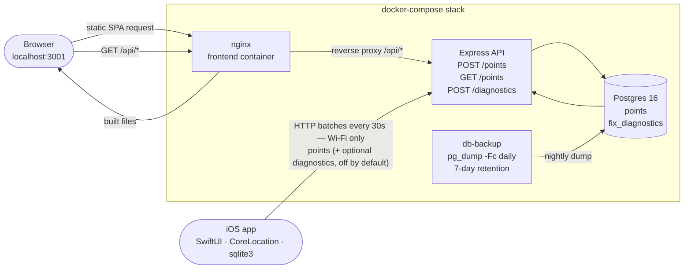

# GpsLogger

Minimal end-to-end GPS tracking system.

> **Design rule:** collect raw location data with **zero interpretation**.
> No trip detection, no movement classification, no behavior analysis —
> just `collect → store → visualize`.

> **New here?** Skip straight to [`QUICKSTART_CLAUDE_CODE.md`](QUICKSTART_CLAUDE_CODE.md)
> for a step-by-step walkthrough that uses Claude Code to bring up the
> backend, install the iOS app on your phone, and visualize your first
> route. The rest of this README documents the architecture and data
> contract.

## Parts

| Component | Tech | Purpose |
|---|---|---|
| **iOS app** (`ios/`) | SwiftUI + CoreLocation + CoreMotion + raw sqlite3 | record GPS points for walking, cycling, or motorized transport (activityType hint swapped at runtime via `CMMotionActivityManager`), store locally, sync in **Wi-Fi-only** batches; optional second channel (`fix_diagnostics`, off by default since 1.2.10) uploads raw CLLocation diagnostics for post-hoc anomaly analysis; opt-in Auto Wake via SLC (1.2.12) with a unified home-zone anchor (1.2.13) and a gap clause on the persist gate (1.2.14) so the anchor silences overnight wake-up phantoms and indoor-jitter writes without downsampling continuous walks |
| **Backend** (`backend/`) | Node.js 20 + Express 4 + pg | accept point batches and diagnostic batches, query points by time range |
| **DB** | PostgreSQL 16 | two tables: `points` (the visible trace) and `fix_diagnostics` (raw CLLocation fields + filter decision, opt-in since 1.2.10 — iOS only writes + uploads when `syncDiagnosticsEnabled` is flipped on) |
| **Frontend** (`frontend/`) | Vite + React 18 + TypeScript + react-leaflet | visualize a route as a uniform-color polyline with per-point address + cumulative distance and elapsed time from start (1.4.1); dark/light/system theme support with FOUC prevention (1.6.0); 0.25-step fractional zoom + default `from` = today 00:00 local (1.4.2); auto-visualize on reload when a device_id is already stored (1.4.3); Google-Photos-style minimap with draggable viewport + zoom slider, snappy trackpad zoom, poles-fit min-zoom floor (1.5.0); zoom-aware direction arrows that hold constant on-screen spacing across zoom levels, paired with server-side sampling so long time ranges render the full trace without the 10 k truncation cap (1.7.0) |
| **Docker** (`docker-compose.yml`) | docker-compose | one-command backend + DB bring-up |

## Data contract

All three tiers agree on a single shape.

### `POST /points`

Body: **raw JSON array** (not an envelope object):

```json
[
  { "latitude": 37.7749, "longitude": -122.4194, "created_at": "2024-01-01T12:00:00.000Z", "device_id": "B1F2…" },
  { "latitude": 37.7750, "longitude": -122.4180, "created_at": "2024-01-01T12:00:05.000Z", "device_id": "B1F2…" }
]
```

Rules:

- `latitude` ∈ `[-90, 90]`, finite number
- `longitude` ∈ `[-180, 180]`, finite number
- `created_at` is an ISO 8601 string in **UTC**
- `device_id` is a non-empty string ≤ 128 chars (stable per install, see iOS `DeviceIdentity`). The iOS app stamps it on the upload payload from a single cached source — it is **not** duplicated into every row of the local SQLite queue.
- batch size ≤ 1000 (iOS app uses ≤ 100)

Response:

```json
{ "inserted": 2, "submitted": 2 }
```

`inserted` is the number of rows that actually landed in the DB, `submitted`
is the batch size. They differ when the backend skips duplicates on the
idempotency key `(device_id, created_at)` — a successful retry of an
already-accepted batch returns `{ "inserted": 0, "submitted": 2 }` without
error. See migration `004_idempotency.sql` and the unique index.

Errors:

```json
{ "error": "points[3].latitude: must be a finite number in [-90, 90]" }
```

### `POST /diagnostics`

Debug/observability channel. When enabled, every raw `CLLocation` that
enters the iOS tracker pipeline is uploaded here together with the
`LocationFilter` verdict, for post-hoc classification of GPS anomalies
(GNSS vs Wi-Fi / cell-tower fallback vs sensor-fusion drift). Never read
by the main frontend — queried directly via psql after an incident. See
[`QA.md`](QA.md) for the extraction workflow.

**Off by default since 1.2.10.** The channel was scaffolding for filter
tuning and accounts for ~95% of on-device writes and uplink bytes in a
typical walk. Enable per-device at runtime — no rebuild — when a new
tuning campaign starts (cycling / automotive filter work):

```
defaults write com.gpslogger.personal syncDiagnosticsEnabled -bool YES
```

Kill + relaunch the app so `LocationTracker` and `SyncService` both
re-read the flag. Turn off again with `-bool NO`. The backend endpoint
itself stays available regardless of whether any device is producing
rows.

Body: raw JSON array, same envelope shape as `/points`:

```json
[
  {
    "logged_at":         "2026-04-15T17:45:00.000Z",
    "fix_timestamp":     "2026-04-15T17:45:00.000Z",
    "latitude":          39.46975,
    "longitude":         -0.37739,
    "horizontal_accuracy": 8.2,
    "vertical_accuracy":   4.5,
    "altitude":           15.3,
    "speed":               1.3,
    "speed_accuracy":      0.4,
    "course":             92.0,
    "course_accuracy":     5.0,
    "decision":           "accept",
    "device_id":          "B1F2…"
  }
]
```

Rules:

- `latitude` / `longitude` same ranges as `/points`.
- `logged_at` is the wall-clock moment the iOS tracker captured the fix;
  `fix_timestamp` is `CLLocation.timestamp`. Both are ISO 8601 UTC.
- All seven raw CLLocation numeric fields (`horizontal_accuracy`,
  `vertical_accuracy`, `altitude`, `speed`, `speed_accuracy`, `course`,
  `course_accuracy`) must be finite numbers. **Negative values are
  preserved** — they are Apple's documented sentinels for "no data" and
  are the load-bearing signal for classifying network-origin fixes.
- `decision` is the `LocationFilter` verdict tag (e.g. `accept`,
  `discard:nonGpsSource`, `discard:poorAccuracy`, `spikeReplaced`,
  `buffered`), non-empty string ≤ 64 chars.
- `device_id` same rules as `/points`.
- batch size ≤ 1000 (iOS app uses ≤ 100).

Response: `{ "inserted": N, "submitted": M }` with the same idempotency
semantics as `/points` (duplicate `(device_id, fix_timestamp)` rows are
silently skipped). No GET — reads go straight to Postgres.

### `GET /points?device_id=<id>&from=<ISO>&to=<ISO>`

`device_id` is **required** — the endpoint is always scoped to one device so an
unauthenticated caller cannot enumerate the full dataset. `from` and `to` are
optional. Returns an envelope with the matching fixes **sorted ASC by
`created_at`**:

```json
{
  "data": [
    { "id": 1, "latitude": 37.7749, "longitude": -122.4194, "created_at": "2024-01-01T12:00:00.000Z" },
    ...
  ],
  "sampled": false,
  "total": 1234
}
```

`total` is the full count of matching fixes in the DB. When `total` exceeds
the server-side sample target (50 000), the endpoint returns an
evenly-spaced stride of the trace instead of every fix (`sampled: true`).
The first and last fixes are always preserved so the Start/End markers
land on the real endpoints; the route shape is intact at lower fidelity.
Narrow the time range to recover full detail.

### Schema

```sql
-- 001_init.sql
CREATE TABLE points (
    id          SERIAL PRIMARY KEY,
    latitude    DOUBLE PRECISION NOT NULL,
    longitude   DOUBLE PRECISION NOT NULL,
    created_at  TIMESTAMPTZ      NOT NULL
);
CREATE INDEX idx_points_created_at ON points (created_at);

-- 002_device_id.sql
ALTER TABLE points
    ADD COLUMN IF NOT EXISTS device_id TEXT NOT NULL DEFAULT '';
CREATE INDEX IF NOT EXISTS idx_points_device_id_created_at
    ON points (device_id, created_at);

-- 004_idempotency.sql (after 003; declared out of order here for clarity)
-- Removes any pre-existing duplicates, then creates a unique index so
-- that retried-after-lost-response batches are idempotent.
CREATE UNIQUE INDEX idx_points_unique_device_created
    ON points (device_id, created_at);
CREATE UNIQUE INDEX idx_fix_diagnostics_unique_device_fix
    ON fix_diagnostics (device_id, fix_timestamp);

-- 003_fix_diagnostics.sql
CREATE TABLE fix_diagnostics (
    id                  SERIAL PRIMARY KEY,
    logged_at           TIMESTAMPTZ      NOT NULL,
    fix_timestamp       TIMESTAMPTZ      NOT NULL,
    latitude            DOUBLE PRECISION NOT NULL,
    longitude           DOUBLE PRECISION NOT NULL,
    horizontal_accuracy DOUBLE PRECISION NOT NULL,
    vertical_accuracy   DOUBLE PRECISION NOT NULL,
    altitude            DOUBLE PRECISION NOT NULL,
    speed               DOUBLE PRECISION NOT NULL,
    speed_accuracy      DOUBLE PRECISION NOT NULL,
    course              DOUBLE PRECISION NOT NULL,
    course_accuracy     DOUBLE PRECISION NOT NULL,
    decision            TEXT             NOT NULL,
    device_id           TEXT             NOT NULL
);
CREATE INDEX idx_fix_diagnostics_device_fix_timestamp
    ON fix_diagnostics (device_id, fix_timestamp);
```

Notes:
- `TIMESTAMPTZ` (not `TIMESTAMP`) so values round-trip correctly through `pg`
  regardless of container timezone.
- The composite `(device_id, created_at)` index covers the primary read
  pattern for points: `WHERE device_id = ? AND created_at BETWEEN ? AND ? ORDER BY created_at ASC`.
- The `(device_id, fix_timestamp)` index on `fix_diagnostics` covers the
  incident-investigation read: `WHERE device_id = ? AND fix_timestamp
  BETWEEN ? AND ? ORDER BY fix_timestamp`.
- `device_id` on `points` ships with `DEFAULT ''` so the `002` migration is
  non-blocking on a populated table; new rows must supply a non-empty value
  (enforced at the API layer).
- `fix_diagnostics` has no default on `device_id` because the iOS client
  always supplies it. Raw CLLocation columns are `DOUBLE PRECISION NOT NULL`
  without range constraints — negative values are Apple's sentinels for
  "no data" and are exactly what we need to preserve.

### Data retention

The backend ships **no automated retention**. Both `points` and
`fix_diagnostics` grow without bound. This is a conscious decision, not an
oversight:

- **Volume is manageable.** With aggressive client-side filtering (three
  gates in `LocationFilter`, stationary suppression) a daily-active single
  user produces ~1–5 k points/day, or a few million rows per year.
  Postgres + the composite `(device_id, created_at)` index handle that
  comfortably on any reasonable host.
- **History belongs in backups, not tables.** The `db-backup` sidecar
  (see `docker-compose.yml`) runs `pg_dump -Fc` every 24 h and keeps
  seven days of dumps in the `db-backup` named volume. Long-term history
  lives there; the hot tables carry only what's currently useful.
- **Pruning is a deployment choice.** If a specific operator needs to
  cap growth, the natural pattern is a time-range `DELETE` on
  `fix_diagnostics` first (debug-only, no UI dependency), then on
  `points` only if unavoidable. No migration ships to do this
  automatically — the decision about what to keep is per-deployment.

The **iOS device's local SQLite is different**: `fix_diagnostics` rows
are pruned after 3 days (`cleanupDiagnostics`), and `points` rows are
deleted immediately after a successful 2xx upload to `/points`. The
on-device DB is a staging buffer, not a store of record; the backend
Postgres is authoritative for everything.

## Running it

### 1. Full stack via Docker Compose (recommended)

```bash
docker compose up --build
```

Brings up four services:

| Service | Host port | Purpose |
|---|---|---|
| **db** | `5434` (→ container `5432`) | Postgres 16, data in the `db` named volume |
| **db-backup** | — | Sidecar that runs `pg_dump -Fc` into the `db-backup` named volume once every 24 h with 7-day retention (`find -mtime +7 -delete`). `tmpfs` mounted over `/var/lib/postgresql/data` to avoid Docker creating an anonymous volume for the postgres image's declared VOLUME |
| **backend** | `3000` | Express API |
| **frontend** | `3001` | nginx serving the built SPA + `/api/*` reverse proxy to `backend:3000` |

Wait for:

```
[migrate] applied 001_init.sql
[api] listening on :3000
```

Sanity checks:

```bash
curl -fsS http://localhost:3000/health            # backend direct  → {"ok":true}
curl -fsS http://localhost:3001/                  # frontend index  → HTML
curl -fsS 'http://localhost:3001/api/points?device_id=demo&from=2000-01-01T00:00:00Z&to=2100-01-01T00:00:00Z'
#                                                  # frontend → nginx → backend → []
```

Then open **http://localhost:3001** in your browser. The UI has a **Device ID**
field (persisted in `localStorage`), a **From**/**To** datetime pair, a
**Visualize** button, and a **Logout** button that clears the stored device ID
and resets the view. No auto-refresh.

### 2. Frontend in dev mode (optional)

For hot-reload while working on the frontend, run the Vite dev server directly
against the dockerized backend:

```bash
cd frontend
npm install
npm run dev
```

Open http://localhost:5173. The dev server defaults to `http://localhost:3000`
for the API; override via `frontend/.env` if needed:

```
VITE_API_URL=http://localhost:3000
```

### 3. iOS app

See [`ios/README.md`](ios/README.md) for full Xcode setup steps (project creation,
Info.plist keys, background-mode capability, free Apple ID signing).

Short version (xcodegen-based build from the CLI):

1. `cp ios/GpsLogger.xcconfig.example ios/GpsLogger.xcconfig`
2. Edit `ios/GpsLogger.xcconfig` and fill in two values:
   - `DEVELOPMENT_TEAM` — your Apple Team ID
     (`security find-identity -p codesigning -v`).
   - `API_BASE_URL` — your Mac's LAN IP (`ipconfig getifaddr en0`),
     e.g. `http:/$()/192.168.1.129:3000`. The `$()` is an empty
     variable expansion that escapes `//` from xcconfig comment
     parsing — after expansion the value is the plain URL
     `http://192.168.1.129:3000`. iPhone and Mac must share the same
     Wi-Fi.
3. `cd ios && xcodegen generate`
4. Open the generated `GpsLogger.xcodeproj` in Xcode, pick your
   iPhone in the device picker, hit **Run**. First time: on the
   iPhone, go to Settings → General → VPN & Device Management and
   trust the developer profile.
5. Verify the URL landed in the build:
   ```
   plutil -p ~/Library/Developer/Xcode/DerivedData/GpsLogger-*/Build/Products/Debug-iphoneos/GpsLogger.app/Info.plist | grep API_BASE_URL
   ```

See [`ios/README.md`](ios/README.md) for full details on the xcodegen +
CLI install path via `devicectl`, the free Apple ID 7-day provisioning
lifetime, and the `Config.apiBaseURL` resolution chain.

## Architecture summary



### iOS — collection rules

- **Always-on tracker.** There is no Start/Stop button — `LocationTracker`
  starts in `AppContainer.init` and runs for the lifetime of the app. The UI
  shows a pulsing green dot when active and an unsynced-points counter.
- **Only** `CLLocationManager` drives point collection — the app uses **no
  timers for location**. Points are inserted exclusively in the
  `didUpdateLocations` callback. A `Timer` exists, but only inside
  `SyncService`, to schedule HTTP uploads.
- **Multi-modal `activityType`.** A single install tracks walking,
  cycling, and motorized transport (car, bus, train) with the right
  CoreLocation hint for each mode. `MotionClassifier` wraps
  `CMMotionActivityManager` — which reads the phone's inertial sensors,
  not GPS speed — and emits a coarse mode (`.pedestrian`, `.cycling`,
  `.automotive`, `.unknown`) that `LocationTracker` maps to
  `CLLocationManager.activityType`: `.fitness` for pedestrian/cycling,
  `.automotiveNavigation` for any motor vehicle. Startup default is
  `.fitness`, so a fresh launch behaves exactly like a pedestrian
  tracker; the hint flips only on medium/high-confidence readings, and
  low-confidence or `stationary` readings do not change the hint
  (prevents thrashing). Requires the **Motion & Fitness** permission —
  if denied or restricted, the classifier emits an `onUnavailable`
  signal and the tracker surfaces a `motionPermissionDenied`
  impairment banner in the UI; the app stays on `.fitness` permanently
  until the permission is restored. The source gate in `LocationFilter`
  is the real defense against bad GPS regardless of mode —
  `activityType` only biases CoreLocation's fusion, it does not by
  itself accept or reject fixes.
- **Tracking impairment UI.** `LocationTracker` publishes a
  `Set<TrackingImpairment>` that surfaces three degraded states as an
  orange banner at the top of `ContentView`: `.permissionDenied` (no
  tracking at all), `.backgroundRequiresAlways` (user has WhenInUse
  only — foreground tracks fine but background silently drops), and
  `.motionPermissionDenied` (vehicle mode never engages, stays on
  `.fitness`). The state machine in
  `locationManagerDidChangeAuthorization` also resets `LocationFilter`
  and `StationaryDetector` when permission is restored after a denial,
  so stale anchors from the old session don't bleed into the new one.
- **Correctness + resilience hardening** (1.2.1):
  - `Database.insert` and `Database.logDiagnostic` return `Bool`;
    `LocationTracker` only increments the in-memory unsynced counter
    on confirmed SQLite success, so disk-full or schema-mismatch
    failures can no longer drift the UI counter off the real row count.
  - Both the database-write path and the sync-drain path hop onto
    private serial queues (`persistQueue` in `LocationTracker`,
    `syncQueue` in `SyncService`), so the main thread never blocks on
    synchronous SQLite reads/writes and the `in-flight` Bool flags
    live on a single serial owner instead of racing between the main
    `Timer` callback and the URLSession background completion.
  - `LocationFilter` drops a stale `pending` spike if it has aged past
    `Config.pendingTimeoutSeconds` (30 s), preventing a buffered fix
    from surviving an app backgrounding and corrupting the next
    session's filter state.
  - `StationaryDetector` guards against a negative `age` computed from
    an older anchor timestamp (NTP correction, DST transition, cached
    replay) and resets the candidate instead of stalling forever in
    Phase A.
- **Post-indoor GPS reacquisition defense** (1.2.2):
  - `LocationFilter` rejects cached CoreLocation fixes whose timestamp
    is more than 10 s behind wall-clock time (stale-delivery gate).
  - After a gap > 60 s between accepted fixes, the accuracy ceiling
    tightens from 50 m to 20 m, filtering multipath convergence fixes
    that report optimistic `horizontalAccuracy` after extended indoor
    or background signal loss (gap-aware accuracy gate).
  - `locationManager(_:didFailWithError:)` now switches on `CLError.code`:
    `.denied` stops the tracker and surfaces a permission impairment,
    `.locationUnknown` is ignored as transient, the rest is logged
    only under DEBUG.
- **Home-zone gap clause** (1.2.14). The 1.2.13 home-zone gate at
  the top of `LocationTracker.maybePersist` was unconditionally
  suppressing any fix landing within
  `Config.homeZoneRadiusMeters` (100 m) of a fresh persisted
  anchor. Because the anchor follows the user (it is updated by
  `persist(_:)` after every successful insert), a continuous walk
  produced fixes that were by definition only ~10–15 m from the
  previous anchor (the `minDistance` floor) — and every one of
  them tripped the gate. The trace silently downsampled to one
  row per ~100 m of walking. Field-test data from 2026-04-29
  (iPhone 13 Pro Max, urban evening walk, 27 consecutive pairs):
  `p50 = 105 m`, `min = 99.9 m`, `max = 108.6 m` between
  consecutive persisted points — vs. the pre-1.2.13 baseline of
  `p50 ≈ 11 m` on the same device. A ~10× density loss invisible
  to anything except a SQL distance histogram.
  - **Fix.** Add a gap clause to the gate: only suppress when the
    inter-fix interval exceeds `Config.resumeGapSeconds` (60 s,
    the same threshold `StationaryDetector`'s gap-reset uses to
    decide a returning fix is "fresh"). The combined predicate
    intercepts precisely the indoor-jitter phantom path (long
    quiet window + close-to-anchor returning fix — the
    2026-04-26 case) without touching the dense pedestrian
    stream (sub-second cadence — gap clause never arms).
  - **Test:** added
    `testContinuousWalkingFixInsideHomeZoneIsNotSuppressed` —
    anchor refreshed 2 s ago, fix 15 m away, must reach
    `points`. Updated `testFixInsideHomeZoneSuppressedFromPersist`
    to use a 19-min-old anchor so it actually exercises the gap
    clause it claims to test (the prior version coincidentally
    passed because the rolling-anchor bug was matching its
    expectation).
  - **What did NOT change:** LocationFilter, KalmanSmoother,
    StationaryDetector, the SLC wake monitor, the home-zone
    radius, the deadlock fix from 1.2.6 / 1.2.9. The fix is
    one extra `&&` clause on the existing predicate.
- **Frontend empty-range crash fix** (1.5.2). Selecting a time
  range with zero points produced a white screen (`TypeError:
  Cannot read properties of undefined (reading '_leaflet_pos')`).
  Cause: `RouteMinimap`'s rect-update effect called
  `mini.latLngToContainerPoint(...)` on a Leaflet map that had
  just been torn down — the inner `<MapContainer>` unmounts when
  `points.length === 0` (the existing render-time short-circuit),
  but the parent's `mini` state retained the now-detached
  reference and the effect ran one more time on the
  `positions`-changed re-render. React unwound the entire tree on
  the unhandled error → blank page. **Fix:** add
  `positions.length === 0` to the effect's early-return guard so
  it cannot outlive the map. App.tsx already had defensive guards
  for empty / malformed responses (`Array.isArray(result?.data)`,
  `hasQueried` flag for the `"No points found for this time
  range"` status); they were defending a level above where the
  crash actually occurred. Verified end-to-end via Playwright
  (empty → non-empty → empty round-trip, zero console errors,
  map stays rendered, status text updates).
- **Unified home-zone anchor** (1.2.13). Three previously
  independent decisions — should we enter `.deferred` on a
  SLC-launch, should a wake-monitor fix promote out of `.deferred`,
  should this accepted fix bypass the persist pipeline — collapse
  into one predicate: distance from the persisted anchor against
  `Config.homeZoneRadiusMeters` (100 m). Anchor lives in
  `UserDefaults` as a triple (`lastAnchorLatitude`,
  `lastAnchorLongitude`, `lastAnchorTimestamp`), updated by
  `LocationTracker.persist(_:)` after every successful SQLite
  insert, so it tracks the user's most recent recorded position
  without any "set my home" UI. Stale anchors (> 24 h) short-
  circuit all three call sites back to pre-1.2.13 always-on
  behavior, so a returning user from a long trip immediately
  records again at the new location.
  - **Phantom-points fix.** The 2026-04-26 forensic case (two
    points appearing 33 m and 44 m from the evening's last
    accepted fix, after a 19-minute LocationFilter-rejected
    indoor window — both inside the 100 m home zone but bypassed
    by `StationaryDetector`'s gap-reset rule) is the original
    motivator. The home-zone gate sits above smoother + stationary
    in `LocationTracker.maybePersist`, so any fix landing within
    the radius is suppressed before the gap-reset can fire.
  - **Overnight quiet contract.** When iOS spawns the process
    specifically because of a SLC event
    (`launchOptions[.location] != nil` captured by a new
    `AppDelegate`), Auto Wake is enabled, and a fresh anchor
    exists, the tracker enters `.deferred` mode — regular GPS
    stream stays off, only the wake-monitor subscription is
    armed. The blue location indicator does not light up; iOS
    re-suspends the process shortly. The first wake-monitor SLC
    fix outside the home zone promotes to `.fullTracking`.
    Eliminates the visible blue-pill blink + phantom one-off
    points that overnight cellular-tower handoffs produced on
    every SLC delivery.
  - **Conscious-launch UX preserved bit-for-bit.** Manual
    app-icon taps, App Switcher returns, and BGAppRefresh wakes
    have `launchOptions[.location] == nil`, so
    `shouldEnterDeferredMode` returns `false` regardless of
    anchor / Auto Wake state. The deferred path is unreachable
    from any user-initiated launch.
  - **Single-evaluation contract for the SLC-launch flag.**
    `launchedForLocation` is cleared at the end of every
    `handleAuthorizationState` evaluation, so a user who revokes
    permission and re-grants it later (while actively in the
    foreground app) is NOT pushed back into deferred. The flag
    captures *boot* context, not a persistent property.
  - **Mode invariants under permission downgrade.** An
    `.authorizedAlways → .authorizedWhenInUse` downgrade while in
    `.deferred` defensively promotes to `.fullTracking` — SLC
    requires Always per Apple's contract, so under WhenInUse the
    wake-monitor would go silent and we'd otherwise be stuck.
  - **Bootstrapping change.** `AppContainer.init()` is now
    lightweight (DB / identity / state only). A new
    `bootstrap(launchedForLocation:)` is called from
    `AppDelegate.application(_:didFinishLaunchingWithOptions:)`
    so the tracker's mode decision sees the authoritative
    `launchOptions[.location]` flag instead of guessing from
    `applicationState`. The `@UIApplicationDelegateAdaptor` is
    the minimal SwiftUI hook needed to surface that dictionary.
  - 23 new tests in `HomeZoneTests` cover the round-trip + freshness
    invariants, the four-condition decision matrix for
    `shouldEnterDeferredMode`, wake-fix evaluation (inside / outside /
    no-anchor), persist-pipeline gating (suppress / promote / stale /
    anchor-update), `exitDeferredIfNeeded` idempotency, the
    flag-clear contract under both Always and WhenInUse grants,
    and the WhenInUse mode invariants (cold grant + downgrade-from-
    deferred).
- **Auto Wake kill switch + dedicated wake monitor** (1.2.11 / 1.2.12).
  The SLC subscription is owned by a separate `CLLocationManager`
  (`wakeMonitor`) so SLC fixes never enter the persist pipeline —
  they identity-check against `self.wakeMonitor` in the delegate
  and short-circuit. As of 1.2.12 the subscription is **off by
  default**, gated behind `Config.autoWakeEnabled` (UserDefaults
  key `autoWakeEnabled`). The hidden settings sheet is reached by
  tapping the unsynced-points counter ten times in a row
  (≤ 1.5 s between taps); the toggle's setter persists the
  preference and runs the matching `start...` /
  `stopMonitoringSignificantLocationChanges()` call so OFF is a
  real OS-level halt, not a UI flag. Toggling has zero side
  effect on stored points, sync state, or the always-on regular
  tracking; manual app launches still record regardless of the
  setting.
- **Wi-Fi-only uploads + opt-in diagnostics** (1.2.10). Battery-first,
  LAN-first product policy: sync must never run on cellular, personal
  hotspot, or Low Data Mode. The LAN backend isn't even reachable on
  those paths, so every pre-1.2.10 cellular attempt burned 15 s of
  URLSession timeout per channel every 30 s for no useful result.
  Enforcement is **defense-in-depth**:
  1. `URLSessionConfiguration` built by `Config.makeSyncSessionConfiguration()`
     sets `allowsCellularAccess = false`,
     `allowsExpensiveNetworkAccess = false`, and
     `allowsConstrainedNetworkAccess = false`. The OS refuses to carry
     any task on disallowed interfaces, so even if higher-level checks
     misfire no bytes leave on cellular.
  2. `NWPathMonitor` updates feed a `ReachabilitySnapshot`
     (`isSatisfied`, `usesWifi`, `isExpensive`, `isConstrained`) whose
     `isWifiOnlyReachable` predicate gates both `drainPoints` and
     `drainDiagnostics` at the top of every drain. When it isn't true,
     no URLSession task is created at all — no radio wake, no timer
     pressure. On a Wi-Fi-regained transition, the backoff interval is
     reset to the base 30 s so a queue that accumulated during the
     offline window drains on the next tick instead of waiting out an
     inflated retry window.

  Also in 1.2.10: the `fix_diagnostics` channel is gated behind
  `Config.syncDiagnosticsEnabled` (UserDefaults, default `false`). The
  channel was scaffolding for the 1.2.x filter audits (9,300 rows drove
  the 1.2.9 simplification) and accounts for ~95% of on-device disk
  writes and uplink bytes on a typical walk — pure overhead now that
  tracking quality is stable. When the flag is off, `LocationTracker`
  skips snapshot construction and the queue hop entirely (not just the
  SQLite write), and `SyncService.drainDiagnostics` early-returns. The
  table definition, backend endpoint, and 3-day retention cleanup are
  unchanged, so any rows written while the flag was on continue to
  drain the next time Wi-Fi is available. Flip at runtime without
  rebuild for the next tuning campaign:

  ```
  defaults write com.gpslogger.personal syncDiagnosticsEnabled -bool YES
  ```

  then kill + relaunch so both callers re-read the flag.

  9 new tests in `SyncPolicyTests` lock in the predicate across every
  combination (cellular / hotspot / Low Data Mode / offline / wired /
  Wi-Fi-happy / pessimistic default), the URLSession configuration
  regression guard, and the diagnostics flag default + override path.

- **Audit-driven simplification** (1.2.9). An independent review
  of the filter stack against 9,300 real `fix_diagnostics` rows
  across two devices over four days found that several gates were
  firing at ~0% of real traffic, one gate had flipped from defense
  to deadlock-then-relaxation in successive releases, and the
  accuracy ceiling was letting through a tail of fixes that were
  visibly distorting the rendered trace without adding any
  completeness.
  - **Tightened accuracy ceiling** (`Config.maxHorizontalAccuracyMeters`
    50 → 25 m). Empirical iPhone 13 Pro Max p90 = 14 m (near-lossless
    at 25 m). iPhone 8 p90 = 32 m under canopy; the tightened ceiling
    produces honest gaps on the older device instead of the earlier
    regime of persisted `accept` rows at 30–50 m HA that were
    responsible for the "the trace goes through a building"
    artifacts.
  - **Removed the three-tier `poorResumeAccuracy` gate** introduced
    in 1.2.2 and relaxed in 1.2.6. Audit showed 269 lifetime hits
    (all on iPhone 8) concentrated in a single 2026-04-16 session
    whose deadlock the 1.2.6 relaxation was then added to escape —
    zero hits ever on iPhone 13 Pro Max. Subsumed by the tighter
    single 25 m ceiling.
  - **Mode-aware spike buffer** (`Config.spikeJumpMeters`
    750 → 250 m, with `Config.spikeJumpMetersAutomotive` = 750 m
    under `.automotive`). Observed multipath jumps of 410 m on
    iPhone 8 under canopy had been passing the old blanket 750 m
    threshold; the tightened walking/cycling default catches them.
    `LocationTracker.apply(mode:)` flips the threshold via
    `LocationFilter.setAutomotive(_:)` on every MotionClassifier mode
    change, so legitimate 130 km/h × 5 s ≈ 180 m vehicle deltas
    continue to pass.
  - **Stationary suppressions now logged** to `fix_diagnostics` as
    `<filter-decision>:stationarySuppress` (e.g.
    `accept:stationarySuppress`). Previously stationary decisions
    were invisible post-hoc, so the detector could not be tuned
    against real data. Backend / schema unchanged — the `decision`
    column is free text ≤ 64 chars.
  - **Kalman `cos(origin.lat)` cached at reset time** instead of
    recomputed on every `enuOffset` / `latLonFromENU` invocation.
    Micro-optimization; no numerical behavior change. Preserves the
    existing public static signatures for callers that don't have a
    cached cosine (e.g. the round-trip unit test).
  - **Deliberately not done**: Kalman smoother removal, map-matching
    re-introduction, filter-tuning-per-device, attempting to detect
    multipath from post-filter residuals. All rejected on empirical
    grounds (Kalman smoother is doing real work on the clean device
    even if it can't repair biased measurements; everything else is
    out of scope for a platform that does not expose raw GNSS
    pseudoranges).
- **Silent-failure detectors** (1.2.8):
  Three classes of "the app looks fine, nothing is being recorded"
  scenarios now surface as impairment banners instead of failing
  quietly — all motivated by Apple Developer Forum reports and the
  WWDC23/24 Core Location sessions.

  - **Reduced-accuracy detection** (iOS 14+). When the user grants
    "Always" but toggles Precise Location off, `horizontalAccuracy`
    reports on the 1–20 km scale and our 50 m filter ceiling rejects
    every fix. `LocationTracker` now checks
    `CLLocationManager.accuracyAuthorization` on every authorization
    transition and adds `TrackingImpairment.reducedAccuracy` when it's
    `.reducedAccuracy`, so the user sees a banner instead of a silent
    empty trace.
  - **Background App Refresh impairment.** Force-quit recovery via
    `startMonitoringSignificantLocationChanges` requires Background
    App Refresh to be on (globally in Settings > General and per-app).
    `LocationTracker` subscribes to
    `UIApplication.backgroundRefreshStatusDidChangeNotification` and
    surfaces `TrackingImpairment.backgroundRefreshDenied` when it is
    not `.available`, explaining why tracking disappeared after a
    recent force-quit.
  - **`didPauseLocationUpdates` / `didResume` delegate.** Apple docs
    say these are not called when `pausesLocationUpdatesAutomatically
    = false`, but production reports show the system still pauses on
    rare OS/device combinations. The delegate methods now log the
    event and re-issue `startUpdatingLocation()` on pause, so a
    silent iOS-driven pause recovers on its own instead of running
    out the foreground-Timer clock.
  - Pure static mapping helpers
    `TrackingImpairment.impairment(for: CLAccuracyAuthorization)` and
    `impairment(for: UIBackgroundRefreshStatus)` keep the
    classification logic unit-testable without mocking
    `CLLocationManager` or `UIApplication`. 7 new tests in
    `TrackingImpairmentTests`.

- **High-density sampling + Kalman smoother** (1.2.7):
  - `CLLocationManager.desiredAccuracy` promoted from `kCLLocationAccuracyBest`
    to `kCLLocationAccuracyBestForNavigation`. Under partial-sky conditions
    (urban canyon, tree canopy) the fusion engine pulls in more inertial
    data and the reported `horizontalAccuracy` collapses from 32 m
    buckets toward 10–16 m. Battery impact is real (Apple flags this mode
    as "while plugged in / navigating"); accepted trade for continuous
    high-fidelity tracking.
  - `CLLocationManager.distanceFilter` set to `kCLDistanceFilterNone`
    so every computed fix is delivered (~1 Hz) rather than only those
    farther than 10 m from the last one. Row rate in the `points` table
    is unchanged — `LocationFilter.minDistance` still gates persistence
    at 10 m — but the downstream smoother now sees 5–7× more
    observations per persisted point.
  - New `KalmanSmoother` module: 2D constant-velocity Kalman filter
    layered between `LocationFilter.accept` and
    `StationaryDetector.consume`. State: `[x, y, vx, vy]` in local ENU
    meters anchored at the first accepted fix. Process noise σ_a = 2 m/s²
    (multi-modal: covers walking, cycling, typical-driving accelerations).
    Measurement noise R = CLLocation's own `horizontalAccuracy`² — the
    filter trusts Apple's per-sample quality estimate as-is. Resets on
    `dt > 10 s` (stale velocity estimate) or non-positive `dt`
    (out-of-order / duplicate delivery). Output `CLLocation` preserves
    altitude / vertical accuracy / speed / course from the input and
    reports the post-update position-variance RMS as the new
    `horizontalAccuracy`, which is strictly ≤ the input after a few
    updates. 7 unit tests cover first-fix passthrough, accuracy
    improvement, zigzag smoothing, spike damping, long-gap reset,
    out-of-order reset, and ENU round-trip.
  - `StationaryDetector` false-positive after GPS blackout fixed. Prior
    behavior (observed in the 2026-04-17 18:34–18:55 CEST session):
    a 5-minute GNSS blackout during which `LocationFilter` rejected
    every raw sample left the candidate anchor from the pre-gap fix
    untouched; the first returning fix landed with `age >> windowSeconds`
    and was suppressed as stationary-jitter, losing 4 real movement
    points at 18:45:06–18:45:31. New gap-reset guard tracks the
    timestamp of the most recent processed fix and, when the
    inter-sample gap exceeds `Config.resumeGapSeconds` (60 s), treats
    the returning fix as a fresh candidate anchor and clears any
    cached stationary center. Symmetric to the reset logic already
    present in `LocationFilter.pending`. Regression test covers both
    the Phase-A (candidate-only) and Phase-B (stationary-declared)
    variants of the bug.
- **Filter deadlock escape valve** (1.2.6):
  - Gap-aware accuracy gate changed from two-tier (normal ≤ 60 s / tight
    forever) to three-tier (normal ≤ 60 s / tight 60–120 s / relaxed
    > 120 s). Fixes a self-reinforcing deadlock observed in the
    2026-04-16 production session where a 60 s tram-tunnel signal dip
    cascaded into a 17-minute accepted-fix blackout: every new fix
    landed in the 20–50 m band, the gate stayed tight, `dt` kept
    growing, and the receiver never produced a sub-20 m fix while the
    user was under marginal signal. At `dt > 120 s` the ceiling now
    falls back to the normal 50 m, bounding the worst case at two
    minutes instead of seventeen. Multipath convergence defense for the
    typical 30–90 s post-indoor reacquisition is unchanged.
  - `LocationTracker` counts consecutive discards; every 20 rejections
    in a row emits an unconditional `[tracker] WARN: N consecutive
    discards` line so compound deadlocks are visible in Console.app
    without needing the `fix_diagnostics` Postgres query.
  - `LocationTracker` now also subscribes to
    `startMonitoringSignificantLocationChanges` as a secondary wake
    path. SLC is cellular-triangulation powered (no extra GPS radio
    cost), fires on ~500 m displacements, and relaunches the app via
    `UIApplicationLaunchOptionsLocationKey` even from terminated state.
    Defense in depth for genuine iOS-kill scenarios where regular
    background location updates alone won't resurrect the tracker.
- **GPS audit follow-ups** (1.2.5):
  - Stale-delivery gate is now symmetric: `abs(delivery_age) > 10 s`
    rejects both cached replays (timestamp behind wall-clock) and
    fixes whose timestamp is ahead of wall-clock, which happens on
    system-clock skew backward (NTP correction, manual time change,
    DST edge). Both directions produce a fix that cannot be placed
    on a coherent timeline against the anchor `LocationFilter` already
    holds.
  - `LocationTracker.didUpdateLocations` sorts the incoming
    `[CLLocation]` array by timestamp before processing. Apple
    documents the array as already ordered, but the spike-buffer and
    chronology gates are correctness-sensitive to order — sorting
    defensively protects against any future iOS change in array
    semantics, at zero cost (the array is almost always 1–3 elements).
  - First-fix short-circuit in `LocationFilter` is now explicitly
    documented: a multi-hour app relaunch is a first fix, not a first
    fix *after gap*, so the gap-aware accuracy gate is bypassed by
    design. The load-bearing checks (stale-delivery, validity, source,
    50 m accuracy ceiling) have already run, so the fix is still
    guaranteed to be GNSS-origin, non-cached, and within the normal
    accuracy bound.
- **Background sync + error-aware backoff** (1.2.4):
  - `GpsLoggerApp` registers a `BGAppRefreshTask`
    (`com.gpslogger.personal.refresh`) and submits a new request on
    every background scenePhase transition. When iOS wakes the app the
    handler calls `SyncService.drainOnce` and re-submits, so the local
    upload queue drains even when the foreground `Timer` is suspended
    (stationary phone, long indoor stop, airplane-mode recovery). Paired
    Info.plist entries (`UIBackgroundModes += fetch`,
    `BGTaskSchedulerPermittedIdentifiers`) are declared in `project.yml`.
  - HTTP outcomes are classified into a `SyncResult` enum: 2xx →
    `.success`, network errors / 408 / 429 / 5xx → `.retryable`
    (exponential backoff doubles up to 5 min), every other 4xx →
    `.nonRetryable` (batch retained, loud release-build log, interval
    held steady so a client bug — schema drift, rotated key,
    misconfigured URL — surfaces within seconds instead of being masked
    behind a 5 min cadence).
  - `NWPathMonitor` short-circuits the drain when the device has no
    usable network, replacing the previous 15 s URLSession-timeout spin
    in airplane mode / captive portals with a fast no-op skip. Upgraded
    in 1.2.10 to **Wi-Fi-only**: the drain also skips on cellular,
    personal hotspot, and Low Data Mode, and the URLSession itself is
    configured with `allowsCellularAccess = false` as a second
    enforcement layer — see the 1.2.10 subsection below.
  - Fetch → upload → delete is now explicitly documented as
    non-atomic: a crash between a 2xx and the local `DELETE` replays
    the batch, and the backend's unique `(device_id, created_at)` /
    `(device_id, fix_timestamp)` constraints from migration 004 absorb
    the replay. Any future weakening of those constraints must also
    introduce a two-phase commit on the iOS side.
  - `Database` sets `PRAGMA synchronous=NORMAL` explicitly alongside
    WAL mode so the crash-safety posture is reviewable in code rather
    than implicit in the iOS SQLite default.
- **Distance filter (first gate).** `CLLocationManager.distanceFilter` is
  set to `kCLDistanceFilterNone` (1.2.7) so `KalmanSmoother` sees every
  raw fix, but `LocationFilter.minDistance = 10 m` still enforces the
  10 m gate on what gets persisted — the `points` table still holds
  rows spaced ≥ 10 m apart.
- **`LocationFilter` (second gate, GPS noise).** Rules applied in order:
  0. **Delivery age** (1.2.2, symmetric in 1.2.5) — `|now − timestamp| ≤ 10 s`.
     CoreLocation may replay cached locations after a signal gap; Apple's
     documentation explicitly recommends checking fix age. Rejects stale
     cached fixes before any other gate runs. The 1.2.5 symmetric variant
     also rejects fixes whose timestamp is *ahead* of wall-clock, which
     happens on system-clock skew backward (NTP correction, manual time
     change, DST edge).
  1. Validity — `horizontalAccuracy ≥ 0`.
  2. **Source discrimination** — `speed ≥ 0` AND `verticalAccuracy > 0`.
     GNSS fixes populate both (Doppler velocity + 3D solution); Wi-Fi /
     cell-tower fallback fixes leave them at the documented sentinel
     negatives because network positioning has neither velocity nor
     altitude. This is the load-bearing defense against the "park-canopy
     teleport" anomaly where CoreLocation falls back to Wi-Fi Positioning
     and a stale BSSID registration delivers a plausible-looking fix
     hundreds of meters to kilometers off the true position. Accuracy
     gating alone cannot catch it.
  3. Accuracy value — drops fixes with `horizontalAccuracy > 25 m`
     (tightened from 50 m in 1.2.9 after empirical HA distribution on
     two devices over four days showed the previous ceiling was
     letting through a long tail of 30–50 m fixes without meaningful
     completeness benefit; see the 1.2.9 audit subsection below).
  4. Chronology — `Δt > 0` vs. the last accepted fix (rejects replayed /
     cached fixes).
  5. Speed ceiling — rejects implied speeds > 500 km/h (teleport-class
     glitches only; every real surface transport mode passes).
  6. Spike buffer — a fix farther than the spike-jump threshold from
     the last accepted point is held one tick. If the next fix returns
     within 100 m of the last accepted point, the buffered point is
     confirmed as a spike and dropped (A → B(far) → C(near A)). The
     threshold is **mode-aware** (1.2.9): 250 m for
     walking/cycling, 750 m under `MotionClassifier.Mode == .automotive`.
     Pedestrian default tightened from the blanket 750 m after real
     multipath jumps of 410 m on iPhone 8 were observed slipping
     through.
  7. Minimum distance — ≥ 10 m from the last accepted fix.
- **`KalmanSmoother` (third stage, jitter smoothing).** Layered between
  `LocationFilter.accept` and `StationaryDetector.consume`. 2D
  constant-velocity Kalman filter in local ENU meters; uses CLLocation's
  own `horizontalAccuracy` as measurement σ and a 2 m/s² process-noise
  acceleration σ tuned for multi-modal use (walking, cycling, driving).
  Resets on `dt > 10 s` so velocity state never carries across a GPS
  blackout. Output coordinates flow on to `StationaryDetector` and the
  `points` table; `fix_diagnostics` still records the raw CLLocation so
  filter debugging is unaffected.
- **`StationaryDetector` (fourth gate, jitter clusters).** After accepted
  fixes stay within 20 m of a candidate anchor for 150 s, the user is
  declared stationary and subsequent fixes are dropped until one lands more
  than 30 m from the cluster center (10 m of hysteresis). A 1.2.7
  gap-reset guard invalidates the candidate / stationary state when the
  inter-sample gap exceeds 60 s, so a GNSS blackout cannot be
  reinterpreted as sustained stationarity. Coordinates are never smoothed
  or averaged *inside this stage* — smoothing happens upstream in
  `KalmanSmoother` — and `LocationFilter.lastAccepted` keeps advancing so
  the spike/speed gates stay sane across long stationary windows.
- **Diagnostic channel (opt-in since 1.2.10).** When
  `Config.syncDiagnosticsEnabled` is `true`, every raw `CLLocation` that
  enters `didUpdateLocations` — *before* the filter, not just accepted
  ones — is written to a local `fix_diagnostics` table with the filter
  verdict, then uploaded on the same 30 s Wi-Fi sync tick to
  `POST /diagnostics`. The local copy is deleted on successful 2xx and a
  3-day retention window covers backend outages. Used for post-hoc
  anomaly classification; the authoritative store is the backend
  Postgres table. See [`QA.md`](QA.md) for the query workflow.
  Default is `false` — the channel produced ~95% of disk writes and
  uplink bytes on a typical walk and was scaffolding for the 1.2.x
  filter tuning. Flip at runtime via
  `defaults write com.gpslogger.personal syncDiagnosticsEnabled -bool YES`
  (then restart the app) when a new tuning campaign needs real-device
  evidence. Rows written while the flag was on still drain on the next
  Wi-Fi window after it's flipped off.
- **Persistent device identity.** `DeviceIdentity` mints a UUID on first
  launch and stores it in the Keychain (UserDefaults fallback), so the
  same ID survives reinstalls. The ID is owned by `SyncService` and
  stamped on every upload payload from a single cached source — it is
  **not** written into individual rows of the local SQLite. Shown in the
  UI with a copy button.
- **Unsynced counter** lives in memory: seeded once at launch via
  `SELECT COUNT(*)`, then incremented/decremented only. No further count queries.

### Backend — minimalism

- Three routes + health endpoint: `POST /points`, `GET /points`,
  `POST /diagnostics`. No envelopes, no extra layers. Optional
  `API_KEY` bearer-token auth gates the two POST routes — compared
  with `crypto.timingSafeEqual` so the key prefix doesn't leak
  through a response-time side channel. `GET /health` and `GET /points`
  are unprotected so the frontend and Docker healthcheck keep working
  without a token.
- `GET /health` runs `SELECT 1` against the pool and returns 503 on
  failure, so the Docker healthcheck reflects actual DB reachability,
  not just process liveness.
- Parameterized multi-row `INSERT` for O(1) round-trips per batch on
  both write endpoints. `ON CONFLICT DO NOTHING` on the natural
  idempotency keys turns retried-after-lost-response batches into
  no-ops (see migration `004_idempotency.sql`).
- Range query is a `COUNT(*)` against the composite `(device_id,
  created_at)` index followed by a strided `SELECT` (window function
  `ROW_NUMBER()` filtered modulo `ceil(total / target)`). When the
  matching count is at or under the target (50 000) the SELECT is a
  plain `WHERE … ORDER BY` and every fix is returned; above the target,
  an evenly-spaced sample is returned with the first and last fixes
  always preserved. The response envelope (`data`, `sampled`, `total`)
  tells the client whether downsampling was applied so the UI can hint
  at narrowing the range for full detail.
- Structured logging via `pino` with per-request correlation IDs:
  inbound `X-Request-ID` is honored if present, else a UUID v4 is
  minted and echoed back on the response. Every downstream log line
  carries `reqId` so cross-hop trace stitching is free.
- Graceful shutdown on `SIGTERM` / `SIGINT`: stops the HTTP listener,
  drains the pg pool, exits — with an 8 s hard deadline fallback so
  Docker never has to escalate to `SIGKILL` on a clean restart.
- No `GET /diagnostics` — diagnostics are read via psql / a DB browser
  against Postgres directly, not through the API, because they're a
  debug/observability channel and the frontend never displays them.
- Pure-function input validators and a pure-function `computeStride`
  helper with a dedicated unit-test suite (40 tests covering
  `validateBatch`, `validateDiagnosticsBatch`, `validateRange`, and the
  downsampling stride math).

### Frontend — visualization

- User-driven fetch only. **No auto-refresh, no clustering, no heatmap.**
  One exception (1.4.3): a page reload with a previously-stored
  `device_id` auto-fires the same fetch a Visualize click would, using
  whatever `from`/`to` the URL / defaults resolve to on that load. Gated
  on the *initial* `device_id` read from `localStorage` — typing the ID
  after landing on a logged-out page still waits for an explicit click,
  so each keystroke doesn't kick off a request. No polling: after the
  mount fetch, subsequent refreshes require a fresh reload or a manual
  Visualize.
- **Query range in URL.** The `from`/`to` datetime selectors round-trip
  through `URLSearchParams` (ISO UTC, `history.replaceState` so history
  stays clean), so reloading the page or sharing the link hydrates the
  same range. Device ID stays in `localStorage` because it's identity,
  not query state; Logout clears both.
- **Default range = today since local 00:00** (1.4.2). On a fresh load
  with no `from`/`to` params, the picker seeds `from` to local midnight
  of the current day and `to` to "now" instead of the previous rolling
  24 h window. Stable across page reopens during the day (the displayed
  range no longer drifts past midnight) and matches the most common
  ad-hoc query: "where did I go today?". Logout reseeds the same way.
  URL params still take precedence, so shared links are unaffected.
- **Fractional zoom snap** (1.4.2, refined in 1.5.0). `MapContainer`
  uses `zoomSnap = 0.25` so the zoom slider in the minimap rides
  smoothly across the full `[minZoom..maxZoom]` range. `zoomDelta`
  stays at Leaflet's default `1`, so the `+`/`−` buttons and a
  double-tap on the map each advance the zoom by one full level —
  snappy, predictable. A tiny patch on Leaflet's internal
  `scrollWheelZoom._performZoom` makes a trackpad pinch / wheel burst
  also jump ±1 per debounced step instead of the built-in softplus
  fractional zoom, so swipe feel matches the tap feel without
  sacrificing slider smoothness.
- **Route minimap with draggable viewport + zoom slider** (1.5.0).
  A compact overview panel in the bottom-right renders the whole
  route in the page palette, with a clear "viewport rectangle"
  showing which fraction of the route is currently on the main map.
  Areas outside the rectangle are covered by a soft sea-tinted matte
  (`rgba(96, 125, 147, 0.2)`) so the in-view portion reads as
  primary. Drag the rectangle to pan the main map; click elsewhere
  on the thumb to recenter; use the `[−] [slider] [+]` bar below the
  thumb to zoom. The minimap normally stays fitted to the route
  bounds, but expands to `route ∪ main-bounds` when the user zooms
  the main map out past the route so the rectangle and matte stay
  symmetric. Refits are paused during a pointer drag to keep the
  projection stable under the cursor (prior implementation drifted
  as `moveend` re-projected the minimap mid-drag).
- **Poles-fit zoom-out floor + `noWrap`** (1.5.0). `WorldMinZoom`
  dynamically sets `map.setMinZoom(log2(max(W, H) / 256))`, so at
  the lowest allowed zoom the Web Mercator world exactly fills the
  larger container axis — no "other state" with empty chrome or
  horizontal tile wrapping. The basemap TileLayer carries
  `noWrap = true` to keep the world single-copy. `setMaxBounds` is
  deliberately NOT used: bound clamping auto-pans the center to fit
  the view, which caused the route focus (e.g. Valencia) to slide
  off-screen across a zoom-out → zoom-in sequence.
- Splits the time-sorted points into groups whenever consecutive fixes
  are more than **5 minutes** apart, so unrelated trips (or power-off
  periods) never get bridged by a straight "teleport" line.
- Downsamples each group with a shared global budget of ≤ 4000 points
  total, always preserving the first and last fix of each group. (Server
  may have already downsampled to ~50 000 for long ranges (1.7.0); the
  client's stride composes on top.)
- Groups of ≥ 2 points render as a halo + route polyline; groups of a
  single point render as standalone `CircleMarker`s (1.2.4) so an
  isolated fix in a sparse tracking window doesn't silently disappear
  between the status-bar count and the map.
- **Single uniform route color** (1.4.1). The route is drawn in
  `ROUTE_COLOR` (`hsl(215, 80%, 55%)` blue) — no time gradient,
  no speed-based classification, no mode overlay. A short-lived 1.4.x
  experiment inferred walking / cycling / vehicle from GPS-derived speed
  and painted the polyline accordingly; it was reverted because
  heuristic speed→mode classification is unreliable enough on
  multi-modal real-world traces (tram stops, red lights, stop-and-go
  traffic) that fragmented coloring was worse UX than a uniform line.
  Direction-of-travel arrows (below) carry the motion-direction signal
  that the gradient used to imply.
- **Distance from start** (1.4.1). The detail card shown on point click
  reports cumulative distance from the first point of the query window,
  formatted as `"350 m"` below 1 km or `"2.5 km"` at or above. Computed
  by walking the raw (pre-downsample) points with haversine so
  winding-road chord-shortening doesn't undercount; continuous across
  time-gap groups (gap-jump distance is NOT added, but the running total
  carries over, so the last point reports true total traced distance).
- **Elapsed time** (1.4.1). The same detail card also shows wall-clock
  elapsed time from the first point, formatted as `"3 h 42 min"`, `"15 min
  30 s"`, or `"45 s"` depending on magnitude. Includes time-gap durations
  so the value reflects total trip duration, not just active movement.
- **Dark / light / system theme** (1.6.0). Three-state theme toggle in
  the top bar (sun / moon / system icons). Persists choice to
  `localStorage.theme`. System mode follows `prefers-color-scheme` and
  reacts to OS changes live. FOUC prevention via inline `<script>` in
  `index.html` with CSP sha256 hash. All 23 CSS custom properties swap
  between `:root` and `html.dark`; ~40 hardcoded colors were tokenized.
  Map tiles use CSS `invert(1) hue-rotate(180deg)` filter on the free
  `light_all` CartoDB variant (the `dark_all` variant is not available
  on the free tier). Native form controls follow `color-scheme` for
  proper OS-level dark rendering (date pickers use the system accent
  color, which cannot be overridden via CSS).
- **Direction-of-travel arrows** (1.3.1, zoom-aware in 1.7.0): a small
  semi-transparent chevron along each polyline group, oriented to the
  segment's bearing, so direction reads instantly at any zoom.
  Initially placed every ~150 m unconditionally; since 1.7.0 the
  metric interval is recomputed from the current zoom and the median
  route latitude (`arrowIntervalForZoom` → `arrowsAlong`) so the
  *on-screen* spacing stays roughly constant — sparse km-apart markers
  at z=11, every few dozen meters at z=18 — which prevents the
  "braid" pattern dense urban traces produced when fixed metric
  spacing piled multiple arrows on top of each other at low zoom. The
  first and last arrows keep a half-interval clear of the endpoints
  so they don't collide with the Start / End markers. A
  `MAX_TOTAL_ARROWS` global cap derives a shared minimum interval
  from the total route length, so long traces with many time-gap
  groups don't multiply per-group budgets into hundreds of tiny
  glyphs that read as dots at low zoom; `MAX_ARROWS_PER_GROUP`
  remains as a per-group guardrail. Rendered via `L.divIcon` SVG
  with `pointer-events: none` so clicks flow through to the polyline.
- **Start / End markers** (1.3.1): green "S" and red "E" pins on
  distinct circular badges with drop-shadow, plus `Start` / `End`
  tooltips, replacing the earlier same-shape white-filled circles.
  Fixes the "I can't tell where the route starts" feedback that the
  blue-fill vs. red-border treatment could not address on a light
  basemap.
- Clicks snap to the nearest rendered point in **screen-pixel space**
  via `map.latLngToContainerPoint` (30 px radius), so the snap behavior
  stays consistent at every zoom level — the previous degree-based
  radius was ~1 km regardless of zoom and felt erratic at the extremes.
- `fitBounds` on every successful fetch.
- Nginx serves the built SPA with a locked-down CSP,
  `X-Frame-Options: DENY`, `X-Content-Type-Options: nosniff`, and
  `Referrer-Policy: no-referrer-when-downgrade` (see
  `frontend/nginx.conf`). Only `nominatim.openstreetmap.org` and the
  CARTO / OpenStreetMap tile hosts are whitelisted for outbound
  connections.

## Tests

```bash
# backend unit tests (40 cases: validateBatch + validateDiagnosticsBatch
# + validateRange + computeStride downsampling math)
cd backend && node --test test/

# frontend unit tests (48 cases covering splitByTimeGaps, downsampleGroups,
# buildRenderData, arrowsAlong, and the zoom-aware arrow spacing helpers
# `metersPerPixel` + `arrowIntervalForZoom` — the pure functions
# behind the route view)
cd frontend && npm test

# iOS unit tests (74 cases across LocationFilter, KalmanSmoother,
# TrackingImpairment mappings, Database drain, MotionClassifier classify,
# StationaryDetector state machine, and the 1.2.10 Wi-Fi-only sync policy)
cd ios && xcodegen generate && xcodebuild test \
    -project GpsLogger.xcodeproj \
    -scheme GpsLoggerTests \
    -destination 'platform=iOS Simulator,name=iPhone 17'
```

Full QA plan (smoke tests + manual E2E scenarios + `fix_diagnostics`
query workflow after an anomaly): see [`QA.md`](QA.md).

## Layout

```
GpsLogger/
├── README.md                this file
├── QA.md                    test plan + fix_diagnostics query workflow
├── docker-compose.yml       db + db-backup + backend + frontend
├── backend/
│   ├── Dockerfile
│   ├── package.json
│   ├── migrations/
│   │   ├── 001_init.sql
│   │   ├── 002_device_id.sql
│   │   ├── 003_fix_diagnostics.sql
│   │   ├── 004_idempotency.sql
│   │   └── 005_cleanup.sql
│   ├── src/{index,db,log,validate}.js
│   ├── src/routes/{points,diagnostics}.js
│   └── test/validate.test.js
├── frontend/
│   ├── Dockerfile           multi-stage: Node build → nginx serve
│   ├── nginx.conf           static files + /api/* proxy to backend
│   ├── .dockerignore
│   ├── package.json
│   ├── vite.config.ts
│   ├── index.html
│   └── src/
│       ├── {main,App,Map}.tsx
│       ├── {api,route,vite-env.d}.ts
│       ├── route.test.ts                pure-function vitest suite
│       └── styles.css
└── ios/
    ├── README.md                     Xcode setup guide
    ├── project.yml                   xcodegen spec (main + test target)
    ├── GpsLogger.xcconfig.example    template for local signing config
    ├── GpsLogger/
    │   ├── GpsLoggerApp.swift
    │   ├── AppContainer.swift
    │   ├── AppState.swift
    │   ├── ContentView.swift
    │   ├── LocationTracker.swift     delegate, pipeline, diagnostic logging, runtime activityType swap
    │   ├── LocationFilter.swift      validity → source → accuracy → speed → spike
    │   ├── KalmanSmoother.swift      2D constant-velocity KF over accepted fixes
    │   ├── StationaryDetector.swift  jitter-cluster suppression + gap-reset guard
    │   ├── MotionClassifier.swift    CMMotionActivityManager wrapper, emits transport mode
    │   ├── DeviceIdentity.swift      Keychain-backed UUID
    │   ├── SyncService.swift         Wi-Fi-only points + opt-in diagnostics drains
    │   ├── Database.swift            points + fix_diagnostics store
    │   ├── Config.swift
    │   ├── GpsLogger.entitlements
    │   └── Info.plist
    └── GpsLoggerTests/
        ├── LocationFilterTests.swift       20 cases covering every filter gate + pending-timeout + automotive spike-jump widening (1.2.9)
        ├── KalmanSmootherTests.swift        9 cases covering first-fix passthrough, noise attenuation, outlier damping, reset paths, ENU round-trip
        ├── DatabaseTests.swift              7 cases locking in the drain/retention invariants
        ├── MotionClassifierTests.swift     10 cases for the pure classification rules
        ├── StationaryDetectorTests.swift   11 cases for the Phase-A/B state machine + clock-skew guard + gap-reset
        ├── TrackingImpairmentTests.swift    7 cases covering the 1.2.8 silent-failure mappings (accuracyAuthorization, backgroundRefreshStatus, shortMessage sanity)
        ├── SyncPolicyTests.swift           10 cases for the 1.2.10 Wi-Fi-only predicate + URLSession config regression guard + diagnostics flag default/override
        ├── WakeMonitorRoutingTests.swift    3 cases for the 1.2.11 wake-only SLC contract (no persist on wake events)
        ├── AutoWakeSettingsTests.swift      8 cases for the 1.2.12 Auto Wake kill switch (default-off, persistence, @Published mirror, data-safety)
        └── HomeZoneTests.swift             24 cases for the 1.2.13 unified home-zone anchor + 1.2.14 gap clause (round-trip + freshness + decision matrix + wake-fix evaluation + persist gate with gap discriminator + continuous-walk regression + flag-clear contract + WhenInUse invariants)
```
